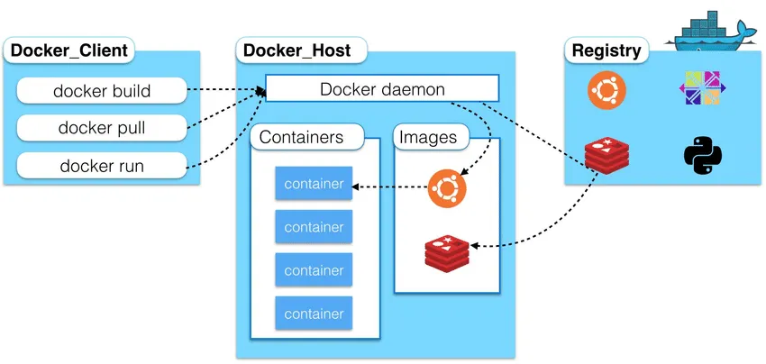
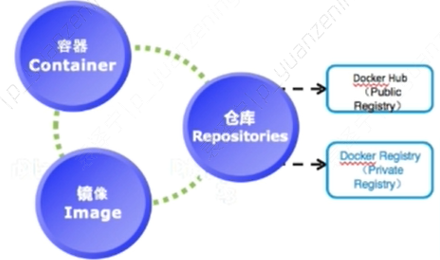
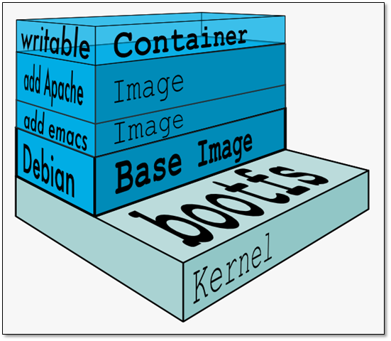
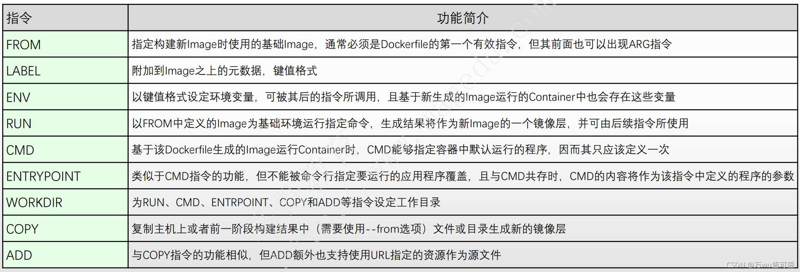

# 认识docker
 docker是Docker.inc 公司开源的一个基于LXC技术之上构建Container容器引擎技术，Docker基于容器技术的轻量级虚拟化解决方案，实现一次交付到处运行。
 docker实现程序集装箱的概念，把我们需要交付的内容集装聚合成一个文件（镜像文件）直接交付。

# docker 基本原理

docker 架构图：


从架构图中我们可以看出，docker有三大核心，包括容器，仓库，镜像

- 镜像（image）：文件的层次结构，以及包含如何运行容器的元数据
- 容器（container）：容器是镜像创建的运行实例，它可以被启动、开始、停止、删除。每个容器都是相互隔离的、保证安全的平台。可以把容器看作是一个简易版的linux环境，Docker利用容器来运行应用
- 仓库（repository）：仓库是集中存放镜像文件的场所，仓库注册服务器上往往存放着多个仓库，每个仓库中又保存了很多镜像文件，每个镜像文件有着不同的标签。

 docker 具有如下特性：

- 文件系统隔离：每个进程容器运行在完全独立的根文件系统中
- 资源限制：每个进程容器运行在自己的网络命名空间中，拥有自己的虚拟接口和ip地址等
- 写时复制：由于镜像采用层式文件系统，所以采用写时复制方式创建镜像的根文件系统，这让部署变得极其快捷，并且节省内存和硬盘空间
- 日志记录：docker会收集和记录每个进程容器的标准流，用于实时检索或批量检索。不消耗本地io
- 变更管理：容器文件系统的变更可以提交到新的镜像中，并可以重复使用以创建更多容器。
- 交互式shell：docker可以分配一个虚拟终端并关联到任何容器的标准输入上。
- namespace隔离：每个进程容器运行在自己的网络命名空间里，拥有自己的虚拟接口和ip地址等

docker 工作流程图：


docker 工作流程大体分为三步：
- build：制作镜像，镜像如同一个集装箱，封装了包括文件，运行环境等资源
- Ship: 运输镜像，将制作好的镜像上传到仓库中，以便拉取
- Run: 运行镜像，通过镜像创建一个容器

docker容器及镜像结构：

Docker 支持通过扩展现有镜像，创建新的镜像，新镜像是从 base 镜像一层一层叠加生成的，每新增一个应用，就会叠加一层镜像。
镜像分层的好处就是共享资源，比如说有多个镜像都从相同的 base 镜像构建而来，那么 Docker 只需在磁盘上保存一份 base 镜像，
同时内存中也只需加载一份 base 镜像，就可以为所有容器服务了。

当容器启动时，一个新的可写层被加载到镜像的顶部，这一层通常被称作“容器层”，“容器层”之下的都叫“镜像层”。
所有对容器的添加、删除、还是修改文件都只会发生在容器层中。
只有容器层是可写的，容器层下面的所有镜像层都是只读的。

# dockers基础操作

docker 原理我们基本普及了，接下来我们进入实战环节。
接下来我们将在windows操作系统上安装docker desktop，需要注意的地方就是windows系统不能是家庭版的，需要开启虚拟化，需要安装WSL2。
具体的流程我就不介绍了，网上能找到比较多的例子

docker 安装完成之后，我们可以运行一个hello world 镜像测试：
```
docker run hello-world

```
命令行窗口输出拉取镜像运行的日志，接下来对镜像和容器进行查看删除等操作：

```
## 查看正在运行的容器
docker ps

## 查看所有容器
docker ps -a 

## 查看镜像
docker images

## 删除镜像

docker rm 容器id

## 删除镜像
docker rmi 镜像id

## 拉取远程仓库镜像
docker pull nginx

## 进入容器
docker exec -it 镜像id /bin/bash
```

# docker 实战
接下来我们创建一个springboot应用并制作成镜像，maven依赖：

```
<dependencies>
        <dependency>
            <groupId>org.springframework.boot</groupId>
            <artifactId>spring-boot-starter</artifactId>
        </dependency>
      
        <dependency>
            <groupId>org.springframework.boot</groupId>
            <artifactId>spring-boot-starter-web</artifactId>
        </dependency>
      
  </dependencies>
    <build>
        <plugins>
            <plugin>
                <groupId>com.spotify</groupId>
                <artifactId>dockerfile-maven-plugin</artifactId>
                <version>1.3.6</version>
                <configuration>
                    <repository>${project.artifactId}</repository>
                    <buildArgs>
                        <JAR_FILE>target/${project.build.finalName}.jar</JAR_FILE>
                    </buildArgs>
                    <tag>${project.version}</tag>
                </configuration>
            </plugin>
            <plugin>
                <groupId>org.springframework.boot</groupId>
                <artifactId>spring-boot-maven-plugin</artifactId>
            </plugin>
        </plugins>
    </build>
```
然后在pom文件的同级目录下创建 Dockerfile:

```
FROM openjdk:8-jdk-alpine
ARG JAR_FILE
COPY ${JAR_FILE} app.jar
ENTRYPOINT ["java","-jar","/app.jar"]
```
`dockerfile-maven-plugin` 是制作镜像的maven插件，插件和build默认绑定，执行build阶段运行该插件，push绑定到deploy阶段。

而dockerfile是制作镜像的描述文件。
Dockerfile是一个文本文件，其内包含了一条条的指令(Instruction)，用于构建镜像。每一条指令构建一层镜像，因此每一条指令的内容，就是描述该层镜像应当如何构建。
Dockerfile参数说明：


在我们执行 `mvn package`指令时会在命令行输出整个docker镜像的制作过程，并在后续能在docker中通过docker images 查看该镜像。
制作好的镜像只是存在我们的本地中，我们可以推到远程仓库到其他机器上运行，而几大云平台都提供了免费的远程私有仓库，比如阿里云效和腾讯云coding。
后续如果有时间会出Jenkins+docker+springboot的详细教程介绍如何一键远程部署我们的应用。 