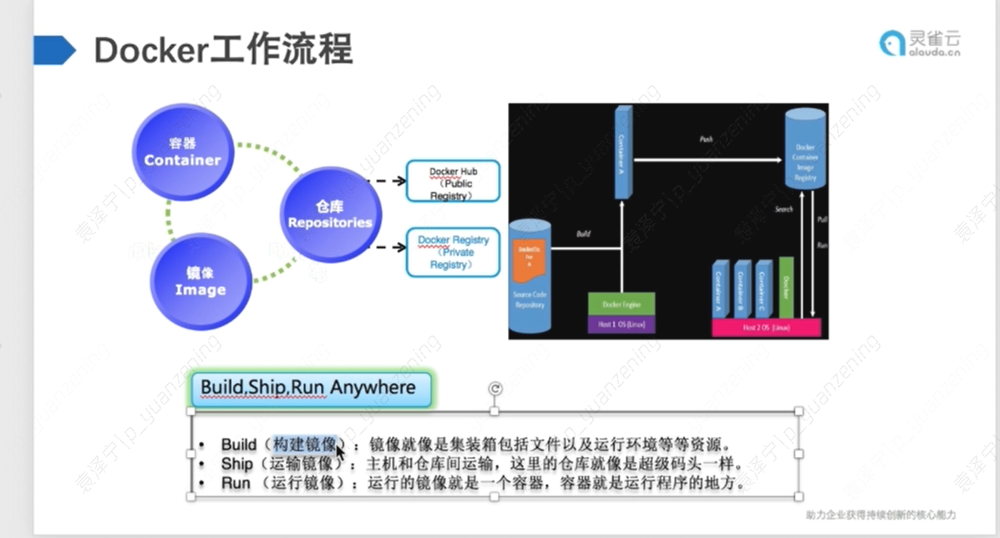
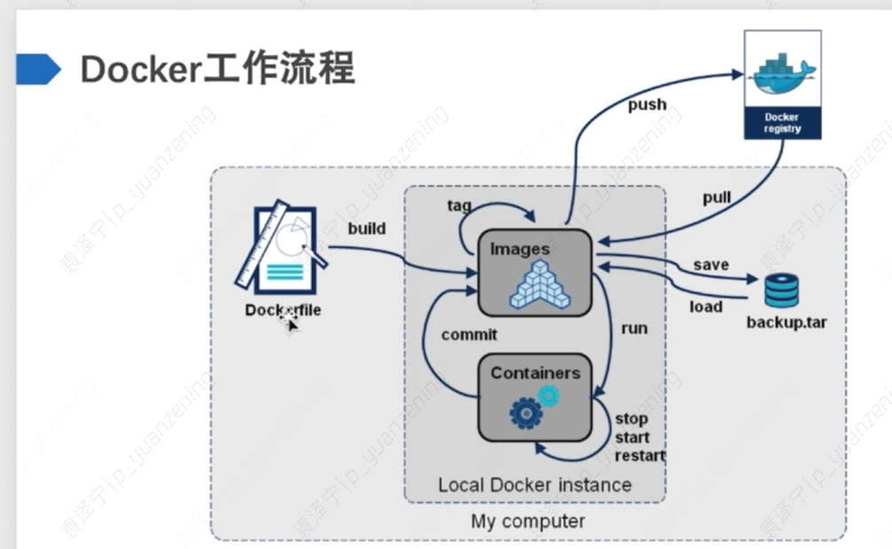

# 认识docker
 docker是Docker.inc 公司开源的一个基于LXC技术之上构建Container容器引擎技术，Docker基于容器技术的轻量级虚拟化解决方案，实现一次交付到处运行。docker实现程序集装箱的概念，把我们需要交付的内容集装聚合成一个文件（镜像文件）直接交付。

# docker 基本原理

## docker 三大核心

docker 三大核心包括容器，仓库，镜像。
- 镜像：文件的层次结构，以及包含如何运行容器的元数据
- 容器：容器是镜像创建的运行实例，它可以被启动、开始、停止、删除。每个容器都是相互隔离的、保证安全的平台。可以把容器看作是一个简易版的linux环境，Docker利用容器来运行应用
- 仓库：仓库是集中存放镜像文件的场所，仓库注册服务器上往往存放着多个仓库，每个仓库中又保存了很多镜像文件，每个镜像文件有着不同的标签。

## docker 特性

- 文件系统隔离：每个进程容器运行在完全独立的根文件系统中
- 资源限制：每个进程容器运行在自己的网络命名空间中，拥有自己的虚拟接口和ip地址等
- 写时复制：由于镜像采用层式文件系统，所以采用写时复制方式创建镜像的根文件系统，这让部署变得极其快捷，并且节省内存和硬盘空间
- 日志记录：docker会收集和记录每个进程容器的标准流，用于实时检索或批量检索。不消耗本地io
- 变更管理：容器文件系统的变更可以提交到新的镜像中，并可以重复使用以创建更多容器。
- 交互式shell：docker可以分配一个虚拟终端并关联到任何容器的标准输入上。
- namespace隔离：每个进程容器运行在自己的网络命名空间里，拥有自己的虚拟接口和ip地址等

## docker 工作流程

# dockers实战

# k8s 指南

kubectl get pods -A -o wide

## 概论 

: Kubernetes中概念的简要概述

Cluster : 集群是指由Kubernetes使用一系列的物理机、虚拟机和其他基础资源来运行你的应用程序。
Node : 一个node就是一个运行着Kubernetes的物理机或虚拟机，并且pod可以在其上面被调度。.
Pod : 一个pod对应一个由相关容器和卷组成的容器组 （了解Pod详情）
Label : 一个label是一个被附加到资源上的键/值对，譬如附加到一个Pod上，为它传递一个用户自定的并且可识别的属性.Label还可以被应用来组织和选择子网中的资源（了解Label详情）
selector是一个通过匹配labels来定义资源之间关系得表达式，例如为一个负载均衡的service指定所目标Pod.（了解selector详情）
Replication Controller : replication controller 是为了保证一定数量被指定的Pod的复制品在任何时间都能正常工作.它不仅允许复制的系统易于扩展，还会处理当pod在机器在重启或发生故障的时候再次创建一个（了解Replication Controller详情）
Service : 一个service定义了访问pod的方式，就像单个固定的IP地址和与其相对应的DNS名之间的关系。（了解Service详情）
Volume: 一个volume是一个目录，可能会被容器作为未见系统的一部分来访问。（了解Volume详情）
Kubernetes volume 构建在Docker Volumes之上,并且支持添加和配置volume目录或者其他存储设备。
Secret : Secret 存储了敏感数据，例如能允许容器接收请求的权限令牌。
Name : 用户为Kubernetes中资源定义的名字
Namespace : Namespace 好比一个资源名字的前缀。它帮助不同的项目、团队或是客户可以共享cluster,例如防止相互独立的团队间出现命名冲突
Annotation : 相对于label来说可以容纳更大的键值对，它对我们来说可能是不可读的数据，只是为了存储不可识别的辅助数据，尤其是一些被工具或系统扩展用来操作的数据

## 

kubectl apply -f app.yaml

https://k8s.easydoc.net/docs/dRiQjyTY/28366845/6GiNOzyZ/puf7fjYr

https://blog.csdn.net/simongame/article/details/106727108