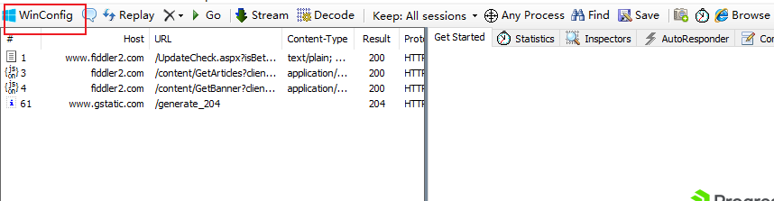
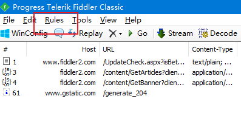
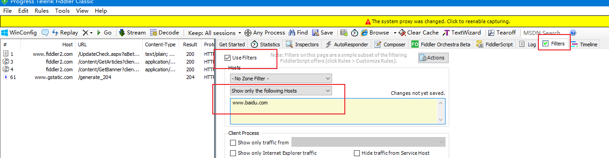
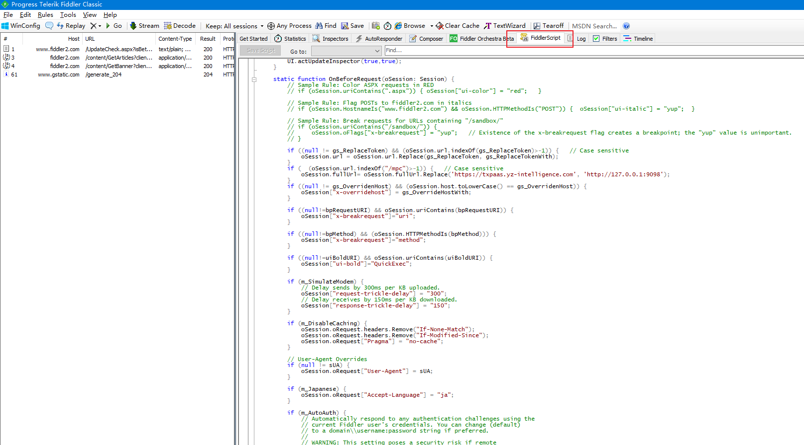
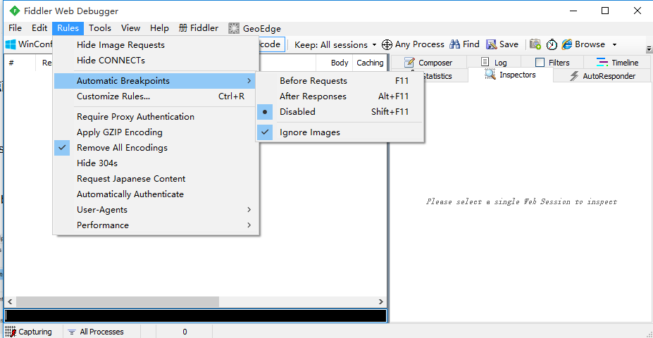
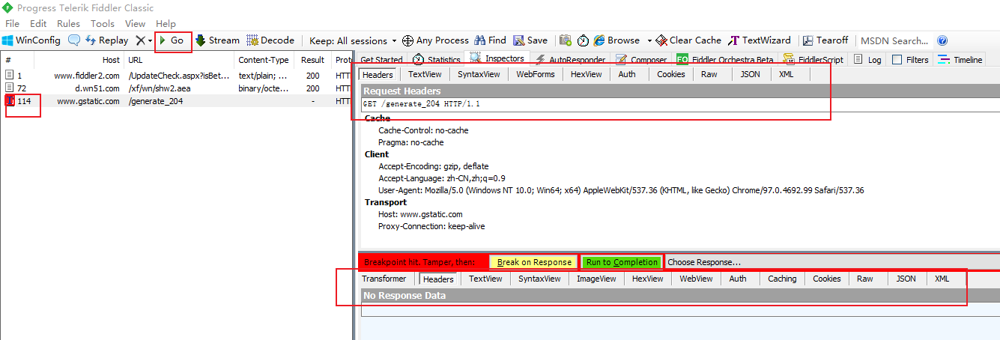

之前我做过一款 chrome代理插件——poseidon-chrome-proxy，这个插件的功能是通过一些配置将浏览器中的请求代理到你配置的服务器上去。这款插件的局限性是只能使用在谷歌浏览器中，而且无法代理https请求，这是因为谷歌浏览器限制了pac脚本对https请求的代理；不仅如此，该插件还存在dns污染的问题，虽然可以通过清除浏览器缓存来解决，但是也是比较糟心。最近项目中恰好遇到了需要对https进行代理的需求，经过我的研究，最终找到了一个比较满意的解决方案，它就是fiddler。

## fiddler 介绍

fiddler 是一款专门用于抓取http请求的抓包工具，当启动该工具时，pc端的请求会先被代理到该工具再转发到服务器，因此我们就可以在请求转发前对请求的协议，请求头，路径，请求内容等信息进行修改。而且通过该工具你还能记录某个请求的数据并进行回放或打断点，相比较代理插件，不仅适用范围更广，调试bug也更方便。

## 使用指南

官方下载地址：https://www.telerik.com/download/fiddler/fiddler4，安装完成后我们进行一些配置:
点击 winConfig,勾选要代理的应用


点击 rules:



勾选 hide connects，隐藏连接信息，这些信息对我们来说是不需要去关注的。

点击 filters, 勾选 use filters ,配置我们需要调试的域名，我这里配置的是 www.baidu.com；该配置会过滤掉无关的域名，使其不会在左侧列表中显示。


### fiddlerScript

fiddlerScript 是这个工具的重头戏，如图所示，该脚本中包含多个方法：


我们可以通过编辑这个脚本实现对请求和响应数据的修改，其语法使用的是javascript。编辑完脚本后需要点击编辑器左上角的 save script 按钮脚本才能生效。
FiddlerScript 中的主要方法包括：

- OnBeforeRequest ：在这个方法中修改Request的内容
- OnBeforeResponse：在这个方法中修改Response的内容
- OnExecAction：在Fiddler界面中左下方的QuickExec Box 中输入指令，如果你的脚本处理了指定的命令，则返回true,否则返回false。
- OnBoot：程序启动时调用该方法
- OnShutdown：程序关闭时调用该方法

一些修改请求数据的示例,

修改cookie:
```
static function OnBeforeRequest(oSession: Session) 
{ 
     if (oSession.HostnameIs('www.example.com') && 
          oSession.uriContains('pagewithCookie') && 
oSession.oRequest.headers.Contains("Cookie")) 
     { 

     var sCookie = oSession.oRequest["Cookie"]; 

     //  用replace方法或者正则表达式的方法去操作cookie的string
     sCookie = sCookie.Replace("cookieName=", "ignoreme="); 

     oSession.oRequest["Cookie"] = sCookie; 
    }
```
修改 requestbody:
```
static function OnBeforeRequest(oSession: Session) 
{ 
    if(oSession.uriContains("http://www.cnblogs.com/TankXiao/"))
    {
        // 获取Request 中的body字符串
        var strBody=oSession.GetRequestBodyAsString();
        // 用正则表达式或者replace方法去修改string
        strBody=strBody.replace("1111","2222");
        // 弹个对话框检查下修改后的body               
        FiddlerObject.alert(strBody);
        // 将修改后的body，重新写回Request中
        oSession.utilSetRequestBody(strBody);
    }
}
```
修改请求路径：
```
static function OnBeforeRequest(oSession: Session) 
{ 
    if (  (oSession.url.indexOf('/test')>-1)) {   
        oSession.url = oSession.url.Replace('www.baidu.com', '127.0.0.1:8080'); 
    }
    
    if (  (oSession.url.indexOf("/test")>-1)) {  
            oSession.fullUrl= oSession.fullUrl.Replace('https://www.baidu.com', 'http://127.0.0.1:8080'); 
        }
}

```

### debug
点击rules-> automatic breakpoint  ->before requests 设置全局断点：

然后我们用浏览器发起一个请求，再观察fiddler:


此时该请求上会有一个 “T” 字形的标记，这个就是进入了断点，我们点击这个请求。在右侧界面可以观察并修改这个请求的数据，包括请求头，请求url，请求体等。修改完成后按上方的 "GO" 按钮执行。然后在右下方就会展示响应信息，如果我们打了 "after Responses" 则会进入断点。

## 避坑指南

- 因为fiddler 需要修改pc端的代理，所以如果当代理被其他应用修改，可能会导致fiddler无法代理http请求，可以检查电脑的 "代理服务器设置" 是否指向 fiddler的端口（默认8888）；
- 如果工具一直弹出 "The system proxy was changed" 提示，则是有程序在后台修改代理设置，一般一些vpn或者浏览器代理插件会干这种事情，可暂时把vpn或者插件关闭，也可以通过进程检查工具进行检查（windows 可使用 processmonitor 搜索 ProxyEnable 定位是什么程序修改了代理）；
- 修改代理脚本前，最好对脚本进行备份。
- 清除电脑上的根证书，WIN+R快捷键，输入：certmgr.msc， 然后回车，查找所有fiddler证书，然后删除。（https://www.cnblogs.com/ql70me/p/10345976.html）
- "The system proxy was changed" 的另外一种解决方案，进入到Fiddler-->Rules-->Customize Rules ：
  
```
  ## 在main()方法上方添加

static function DoReattach(o: Object, ea: EventArgs)
 {
    ScheduledTasks.ScheduleWork("reattach", 1000, innerReattach);
 }
 
 static function innerReattach()
 {
    FiddlerApplication.UI.actAttachProxy();
 }
 
 static function OnRetire()
 {
    FiddlerApplication.oProxy.remove_DetachedUnexpectedly(DoReattach);
 }

### 在main()方法中添加
FiddlerApplication.oProxy.add_DetachedUnexpectedly(DoReattach);

 ```
 

