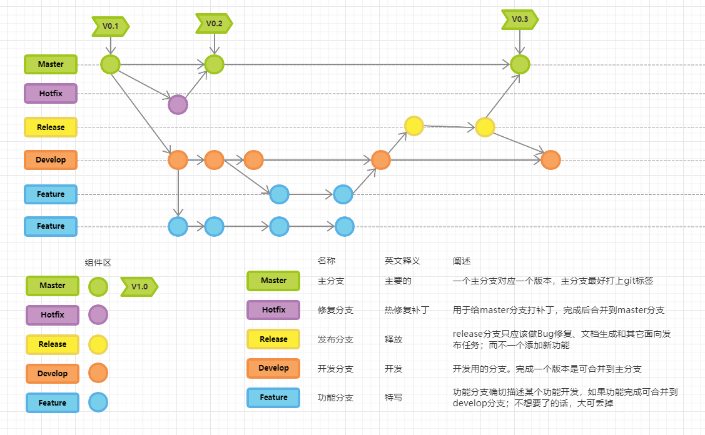
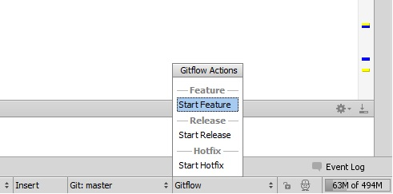

# 代码混乱的常见问题

很多时候我们项目迭代到后期，项目会变得很混乱，往往只有少数人能知道某段代码是干嘛的和该如何去改，或者是干脆谁都不知道，只能靠通过注释去猜测这段代码可能的作用。原因有可能是因为团队内部的人事变动，导致原先写这段代码的人不再管理这段代码了，并且代码写的实在是屎没人捋的清。往往我们称这类代码为“祖传代码”，就像祖宗传下来的代码一样，没人懂没人敢动。祖传代码一多，这个项目就变成了屎一样，开发人员再这基础上迭代就如同屎海翻腾，恶心别人也恶心自己。这是一个很可怕的恶心循环，我们如何去避免这种事情发生呢？先让我们分析下这类代码的通病

<!--more-->

## 代码又臭又长

我见过最长的方法是5000多行，那段代码没人敢动，只敢往下加 if else，每次需要改这段代码的开发都战战兢兢，生怕出现什么莫名其妙的bug。java 可是一门面向对象的语言，一个方法里面有5000多行可以说是很可恶的事情了。我想一开始代码长度可能没这么夸张，是什么导致这种结果的？一个是当初写这段代码的人本身写的是直来直去的方法，一堆if else ；后面迭代的开发，面对这么长的代码瞬间失去了从头读到尾的耐心，直接继续在后面加 if else 迭代，最后这个方法就变成了一个缝合怪一样的玩意。

好的 sql 可以很大程度上简化代码的复杂程度，但是太过复杂sql 本身就会给后来的开发人员造成阅读困难，结果又是变成一条无人敢动的祖传代码，我想这应该是不少公司极度抵制存储过程的原因之一。当然不少银行应用开发还是大量使用存储过程，存储过程有用武之地的，但是一个又臭又长的存储过程就等着变成祖传代码吧。当年我见到一个60多个join的sql，看到第一眼就惊为天人从此难以忘怀，当然那段sql也成了没人敢去动的代码了。

## 代码逻辑不明所以

代码逻辑不明所以是我们开发很容易去犯的毛病，是一个不致命却烦人的毛病。在代码上的体现是，逻辑判断写的比较反人类各种双重否定是肯定，不把你绕晕不罢休。或者是写起代码来东一榔头西一棒槌，让人不知道你想干嘛。导致这个的原因有可能是开发人员在需求理解上出现偏差，做到后面发现不对劲，再回去改又不大可能了，只能硬着头皮往下写，结果就是代码弯弯绕绕；还有很重要的锅是在产品经理，任意变更需求，想一出是一出，开发人员无奈只能跟着想一出写一出。还用可能是开发人员方法或者类命名太艺术了，什么四川方言拼音这种没有十年脑血栓想不出的命名咱就不说了。就说那种国产凌凌漆式的无厘头命名——这看上去是个刮胡刀实际上是个吹风机，就这种不知道让人说什么好。

# 规划代码的核心思想

吐槽了一堆代码规范问题，接下来我们说说如何去规范我们的代码以及如何做到就算开发人员更换了，或者项目转手给他人了，仍然可以让后面的开发可以无碍的去阅读代码修改代码。当然各个公司/团队都有自己的一套代码规范，比如项目的结构、代码命名风格、代码格式等等。不同团队有不同的风格，但核心思想是大同小异的。接下来我就我个人的开发经验来分享一下一些代码规范的思想。

## 花叶论

就我个人而言，这个理解是我代码规范中最浅显也是最核心的思想，只要稍微动动脑子就能想出这个思路出来。或许我们做业务开发的时候，大部分都在写crud，感觉似乎这部分代码没什么规范好说的，其实不然。对一段业务代码而言，我们可以将其分为四类：

- 数据校验
- 业务逻辑
- 数据转换
- 数据库交互（查询与持久化）

大部分时候我们最关心的是逻辑判断相关的代码，其次是数据库交互，对于远程调用的方法，我们就视其为一个普通的方法以简化模型，方法调用算业务逻辑部分的代码，对于读代码的人而言基本上不关心数据校验和数据的转换（DTO转VO等）。因此，代码应该分出一个主次，应该尽量把主逻辑给凸显出来，最好一眼看去就能让人明白这个方法或者这个类干了啥，步骤是什么样的。对于那些不重要但必要的代码我称其为叶，对于那些主要的代码我称其为花。叶是为了衬托花的，因此我们应该将那些叶子代码精简或者隐藏起来。

隐藏叶子代码，突出主干逻辑的一些手法

1）Converter（转换器）

大部分时候我们使用 bean 拷贝使用的是 `BeanUtils` 这个类来完成，然而一些稍微复杂的实体转换，这个类就无法胜任了，这个时候我们只能手动的 get set ,往往就是这些get set 方法掩盖了主干逻辑，让代码结构不清晰。因此我建议在你的业务逻辑代码中引入 `1）Converter` 这个角色来专门负责数据的传递与转换。

2）manager 层

无论我们使用的持久层框架是哪一种，jpa 或者 mybatis 我觉得我们都应该对持久层的部分方法进行简单封装一下，这也是阿里规范里面提倡的。这样做好处是明显的，我们做一个查询时往往要 set 一些查询条件或者对查询结果进行一些简单的判断，往往这类操作在业务代码可能有比较高的重复性。如果把这些代码放到业务逻辑代码里面，少量还好，多了的话就显得很臃肿了。如果把这种代码移到manager层里面去，不仅主业务逻辑代码不会被干扰，还能提高一定的代码复用率。

3）方法简单封装
假设我们一个方法要完成一端逻辑要分成三大步，而每一个步骤又分成几个小步骤，那我们就可以将这个方法拆分成三个方法，然后在这三个方法里面完成各自的步骤。这手法是很简单的，想必大家都能想到，但是我这里要介绍的是简化复杂方法封装的神器——函数式编程，我这里指的函数式编程不仅仅是 stream 流和 lambda 表达式的使用。函数式编程封装适用的场景是：整个流程比较固定，但是某几个步骤变化是不确定的。我们可以去看看 `java.util.function` 这个包的源码，你会发现这个包下面全是接口，这些接口被称为函数式接口。这些函数式接口总体上分为四类：

- Function 类型：传入一个bean 返回另外一个bean
- Consumer 类型：传入一个bean 无返回值
- Predicate 类型：传入一个bean 返回布尔值
- Supplier 类型：没有入参，有出参

以 Consumer 的使用为例：

```java
public User getUser(Consumer<User> consumer){
    User user=new User();
    consumer.accept(user);
    user=userMapper.getUser(user);
    return user;
}

public void doSomething1(){
    User user=getUser(user->{user.setId(1L)});
}

public void doSomething2(){
    User user=getUser(user->{user.setName("xxx")});
}
```
函数式编程的想象空间很大，使用的得当必定会简化你的代码，提高代码复用率。但是在多线程中使用函数式要留意数据的可见性问题。

## 日志和注释的一些个人经验

1）日志

首先我们要明白日志是给人看的，你加这段日志时要考虑清楚，有没有人会去查这段日志，这段日志有没有用。然后我们查阅日志的时候，一般会通过关键词去搜索；因此我们打的日志一定要有关键词，而且这个关键词不要和其他日志重复，不要过长，便于搜索才是王道。大部分情况我们查看日志都是为了追溯bug，那么一个基本原则就是能通过日志分析出业务逻辑或者流程的走向，对此我建议打日志的地方：

- 数据更新：我们有必要知道写库的数据是不是正确的数据；
- 条件分支：便于我们分析业务走的哪一条逻辑；
- 批量写库：打上数据量大小的日志，便于我们分析性能瓶颈。

并不是所有的这些地方都应该打上日志，有的时候我们可能只需要通过一两条日志就能分析出整个流程的问题点在哪，这个时候其他的日志就显得多余了。还有我们打完日志之后应该在本地环境追溯一下，看看这些日志自己是否能读懂，是否有必要，是否少了重要参数。

2）注释

最基本的两个注释——类注释，方法注释相关规范阿里开发手册上就有，我这里就不复述了，我分享下我写注释的个人习惯。
方法注释上除了基本的注释，我还会将产品需求的原文贴重要的部分上去再写上日期，这样做的好处是让别人明白产品需求要求干啥这个方法该干啥，而且产品经理偷偷改需求你还能有追查的根据，有个小本本偷偷记录他的罪行。

代码注释我分享一个我偷师来的小技巧：

```java
pulic void test(){
    /** 1. 从excel 获取 vo*/
    Workbook workBook = getWorkBook(wookbookStream);
    //获取成员信息
    Sheet userSheet = workBook.getSheetAt(3);
     Map<String, UserVO> userVOMap = getUserForExcel(file, userSheet);
    // 获取项目vo
    Sheet projectSheet = workBook.getSheetAt(0);
    ProjectVO projectVO = getProjectForExcel(file, isInsert, userVOMap);
    // 获取任务vo
    Sheet taskSheet = workBook.getSheetAt(1);
    Map<String, TaskVO> taskVOMap = getTaskListForExcel(file, taskSheet, userVOMap);
    /** 2. 插入数据 */
    if (isInsert.get()){
        ......
    }
   /** 3.写入异常信息 */
    if (!isInsert.get()) {
        .....
    }
}
```
如你所见，对于主干的步骤 我用 `/** 1. */`  `/** 2. */` javadoc的注释来标注了，而普通的注释我用 `// ` 标注，因为idea 在纯黑主题下会给 `/**` 这样的注释配上绿色，会比较显眼。我通过这种方式来强调我代码那些是花，哪些是叶子。当然这种方式实际上是不大符合代码规范的，小伙伴们理性取舍，这种手法未必好。

## 六大基本原则

对于面向对象的的语言，六大基本是很重要的开发准则，但似乎大部分人在写代码的时候都不大在意这个，这也是导致一个方法变得又臭又长的一个重要原因之一。对于类的复杂度我们应该遵循单一职责原则——一个类或者方法承担的职责越多，它被复用的可能性就越小，重构或者修改起来就会变得困难重重，我们应该尽量让一个方法只去做一件事情。

对于许多代码我们只要通过一些简单的手法就能很好的提高其扩展性，比如通过接口去实现类与类之间的协作就能提前解决掉许多未知隐患，而且运用得当的情况下还能满足开闭原则与里氏替换原则，其实service层的设计就有那么点味道了，而且spring的特性也支持接口注入List和map，然而许多开发多年的同学都不知道这个特性，这个特性在许多场景下可以提高代码的扩展性，众所周知，map可以减少代码的 if else 分支。

## 方法命名 ‘潜规则’

很多时候，好的方法命名本身就是对代码的一种注释，我这里好的方法命名是指大家约定俗成的命名规则。如果你多留心各个开源框架的代码都会发现一些特定的命名规则。阿里开发手册里面也列举不少命名前缀与后缀的规范，其实各个团队可以根据自己的实际情况规定一些命名规则，降低团队内部的代码阅读的成本。关于我的文章   [设计模式杂谈](https://mp.weixin.qq.com/s/k6utPTmuDmdLwSM9U-f4tA)

介绍过部分命名规则，感兴趣的小伙伴可以去看看。

## 代码提交及版本控制

正确代码提交日志格式可以帮助开发人员及时的缕清代码的修改历史，从而快速的定位问题。以git为例，我们大部分人提交日志就是几个字而已，当然你能够通过日志去定位到自己的修改历史的话，这样做也没什么大问题，但是对于团队而言，你的修改日志要让别人能看懂就得按一定的格式来写了。Git Commit message的 Angular规范中定义的 commit message 格式有3个内容：

- Header Header部分有3个字段： type(必需), scope(可选), subject(必需)
- Body 部分是对本次 commit 的详细描述，可以分成多行。
- Footer不常用，可为空 包括不兼容变动、关闭issue。

这里由于篇幅问题不细说，感兴趣的小伙伴可以百度查查资料。我们团队不一定要按照这么严格的规则来，但是可以制定一个类似的规范来管理提交日志。

对于团队而言，gitflow 是一个很不错的开发流程。可以很大程度上管理好我们的分支代码，避免团队的人由于误操作而导致某个重要分支出现问题。下面贴出gitflow 流程图，对于其具体内容同样不会介绍太多，感兴趣小伙伴去百度吧



# 帮助代码规范的工具

本节主要介绍提高代码质量的idea插件和框架，当然大名鼎鼎的 阿里代码规范插件咱就不介绍了，想必大家多少了解。不过本人感觉这个插件并不适合一些团队，一是感觉这个规范太过严格，对开发人员素质要求太高，二是有的团队有自己的规范规则，而且有可能和阿里规范冲突，不适用于这个插件。下面介绍的插件可能不适合一些小伙伴。我列举出来大家自己寻思吧。

## mapstruct

对于我而言是很喜欢这个东西的，这个框架解决的问题其实就是我上文提到的花叶论中的 “数据转换” 的问题。其实不少公司也有类似的概念——定义一个工具类作用是将 DO转VO 或者 VO转DTO等，一般这类类都是以 `converter` 结尾。而mapstruct这个框架通过编译期生成字节码来自动的生成bean的转换类。我们想将一个bean的数据赋值给另外一个bean只需要去定义接口即可。这样既减轻了开发人员的工作量还将无意义的get和set方法从逻辑代码块中剔除出去。这个框架的缺点是字节码缓存问题，用过类似自动生成字节码工具的小伙伴应该知道——mapstruct 是根据接口去自动生成类的，当我们更新了接口的时候，这个类有可能没重新生成，当然这只有用idea调试的时候才会有的问题，所以也不必太担心。

## checkStyle

idea checkStyle 插件可以通过自定义配置文件来统一团队的代码风格和代码规范，降低团队的交流成本，一般配合 save actions Reborn 食用更佳。关于checkStyle的配置文件网上也不少，这里也不贴出来占篇幅了。

## git flow

前文提到过git flow 给团队带来的好处，idea也有对应的插件——git Flow Integration，可以通过这个插件来规范我们的流程：



开发新功能选择 start Feature 拉取分支，修复bug 选择 Start Bugfix 拉取分支，等等。此外还有 push on finish等功能，小伙伴如果感兴趣可以百度。

## Git Commit Template

这个主要是用来规范git commit 的一个idea插件小工具了，github上也有类似的开源插件。团队内部也可以自己开发一个类似插件，比较简单，成本也不高。

代码规范的一些个人看法就聊到这了，喜欢的小伙伴可以分享一下哦。