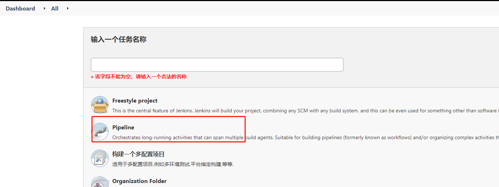
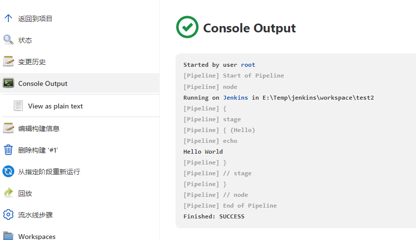
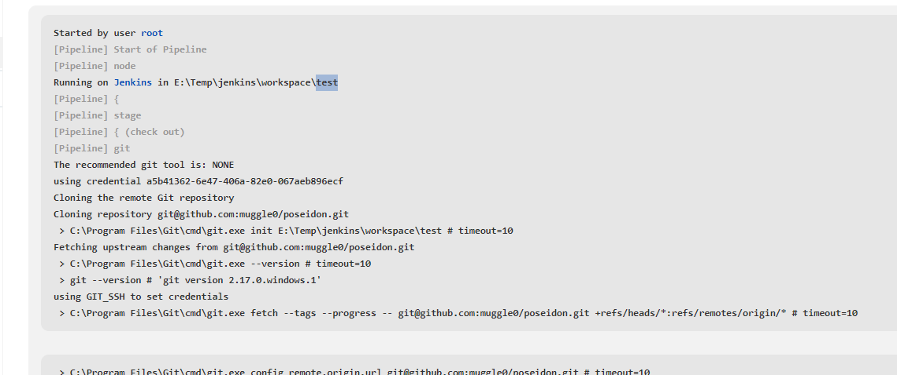
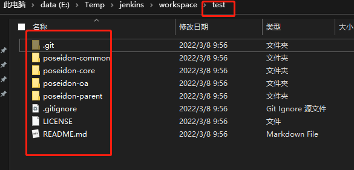

## pipeline 的hello world

pipeline是部署流水线，它支持脚本和声明式语法，能够比较高自由度的构建jenkins任务.个人推荐使用这种方式去构建jenkins。

Jenkins 1.x只能通过界面手动配置来配置描述过程，想要配置一些复杂度高的任务，只能选择自由风格的项目，通过选项等操作进行配置，让jenkins可以下载代码、编译构建、然后部署到远程服务器上，这样显然是不方便管理和移植的。

pipeline的功能由pipeline插件提供，我们可以创建一个jenkinsfile来申明一个任务。接下来我们创建一个最简单的pipeline。登录jenkins,点击创建item:


在流水线中选择hello world 生成代码：

以上便是一个最简单的流水线。点击build now，jenkins任务开始执行，运行完成后点击查看执行记录：

在console output 中可以看到运行记录：

为了提高流水线的复用性以及便于流水线代码的管理，更多的是将pipeline的脚本在远程仓库，当我们修改了远程仓库的流水线脚本，jenkins就会加载到最新的脚本执行。
在流水线配置中选择pipeline script from SCM:

按照提示配置好脚本仓库地址，访问仓库的凭证，流水线脚本文件的名称（默认是Jenkinsfile），分支（默认是master）等。配置完成后在仓库中添加文件`Jenkinsfile`把脚本粘贴过去并push，
最后执行任务，发现执行成功。通过这个特性，我们可以把我们的流水线脚本和项目代码本身放到一个仓库中管理，达到多版本控制并和代码版本统一的效果。
如果我们编写jenkinsfile需要语法提示相关的编辑器，可以使用jenkins官方提供的vscode插件`Jenkins Pipeline Linter Connector `。使用idea  Groovy 也能提示部分语法。
idea 设置jenkinsfile 语法提示方法 settings > editor > File Types > Groovy 新增一列Jenkinsfile:


## pipeline 语法介绍

jenkins pipeline有2种语法：脚本式（Scripted）语法和声明式（Declar-ative）语法。pipeline插件从2.5版本开始同时支持两种语法，官方推荐的是使用申明式语法，在这里也只对申明式语法进行介绍。
申明式语法demo:
```groovy
pipeline {
    agent any

    stages {
        stage('pull') {
            steps {
                echo '拉取代码'
            }
        }
		
		stage('build') {
            steps {
                echo '构建代码'
            }
        }
    }
}
```

声明式语法中，以下结构是必须的，缺少就会报错：

- pipeline：固定语法，代表整条流水线
- agent：指定流水线在哪执行，默认any即可，也可以指定在docker、虚拟机等等里执行
- stages：流水线阶段集合节点，该节点中至少有一个stage
- stage：流水线的阶段节点，每个阶段中至少包含一个steps
- steps：执行步骤集合，每个集合至少包含一个step。
- step: 执行步骤。

## pipeline 实战

接下来我们编译一个本地项目，流水线脚本示例：

```groovy
pipeline {
    agent any
    stages {
        
        stage('Build') {
            steps {
                bat 'mvn -Dmaven.repo.local=E:/data/maven -Dmaven.multiModuleProjectDirectory=E:/Temp/git_jenkins/xxx -f E:/Temp/git_jenkins/xxx/pom.xml -Dmaven.test.skip=true  package'
                
            }
        }
    }
}
```

前文提到过，jenkins会给每个任务在workspacedir下创建文件夹作为运行环境，接下来我们验证通过git将代码下载到这个文件夹下然后打包。流水线脚本：
```
pipeline {
    agent any
    
    stages {
        
        stage("check out"){
             steps {
                git  credentialsId: 'a5b41362-6e47-406a-82e0-067aeb896ecf', url: 'git@github.com:muggle0/poseidon.git',branch: "master"
            }
        }
        
        stage('Build') {
            steps {
                bat 'mvn -Dmaven.repo.local=E:/data/maven  -f ./poseidon-parent/pom.xml -Dmaven.test.skip=true  package'
                
            }
        }
    }
}
```
我配置的workspace 路径是'E:\Temp\jenkins\workspace'，任务名称是 test，看Jenkins 执行指令就能看到相关信息：


打开这个文件夹看看是什么情况：


步骤`check out`把我github上的项目拉到这个工作目录下了，而`Build`则是对项目进行了编译，然后我们可以在target目录找到编译好的jar包，在实际项目中我们可以通过指令将这个jar推到远程服务器上去，或者可以做成docker镜像，推到docker仓库，在远程执行docker指令把这个镜像跑起来，maven插件`dockerfile-maven-plugin` 是可以直接通过一个dockerfile 文件将项目打成一个镜像的。而jenkins 插件`SSH Pipeline Steps`可以远程执行shell 脚本，这样整个流程就串通起来了。这个插件的github地址： https://github.com/jenkinsci/ssh-steps-plugin#pipeline-steps。

插件脚本示例：

```
stage('部署镜像') {
    ansiColor('xterm') {
        def sshServer = [:]
        sshServer.name = "server-1"
        sshServer.host = "127.0.0.1"
        sshServer.port = 22
        sshServer.allowAnyHosts = true
        withCredentials([usernamePassword(credentialsId: 'ServiceServer', passwordVariable: 'password', usernameVariable: 'userName')]) {
            remote.user = "${userName}"
            remote.password = "${password}"
        }
        docker.withRegistry(REGISTRY_URL, REGISTRY_CREDENTIALS_ID) {
            def imgName = "${REGISTRY_DOMAIN}/${DOCKER_NAMESPACE}/${project_name}:${tagName}";

            for (item in ipList.tokenize(',')) {
                // 更新或下载镜像
                sshCommand remote: sshServer, command: "docker pull ${imgName}"
                try {
                    // 停止容器
                    sshCommand remote: sshServer, command: "docker stop ${project_name}"
                    // 删除容器
                    sshCommand remote: sshServer, command: "docker rm -f ${project_name}"
                } catch (ex) {
                }
                // 启动容器
                sshCommand remote: sshServer, command: "docker run -d --name ${project_name} -e TZ=Asia/Shanghai ${imgName}"
            }
        }
    }
}
```
到这里，我们基本上已经掌握了jenkins的基本使用，可以完成将项目下载，编译部署等功能。接下来文章我们会学习一些jenkins的更复杂用法。