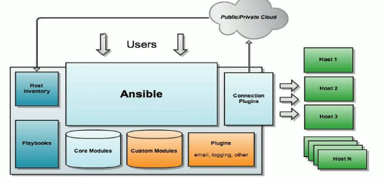
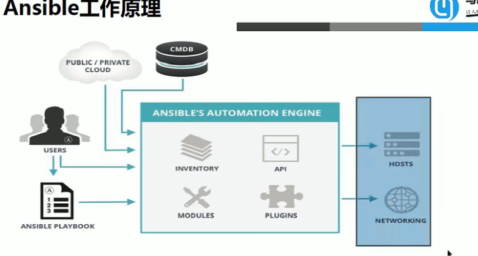

## 什么是Ansible
ansible是一个基于python的自动化运维工具，实现了批量系统配置、批量程序部署、批量运行命令等功能。ansible包括部署和使用简单、默认使用ssh协议、轻量级等特点。

ansible 架构：

https://www.cnblogs.com/keerya/p/7987886.html

懒得写

jenkins 内置四种构建触发器：

- 触发远程构建
- 其他工程构建后触发
- 定时构建
- 轮询scm

