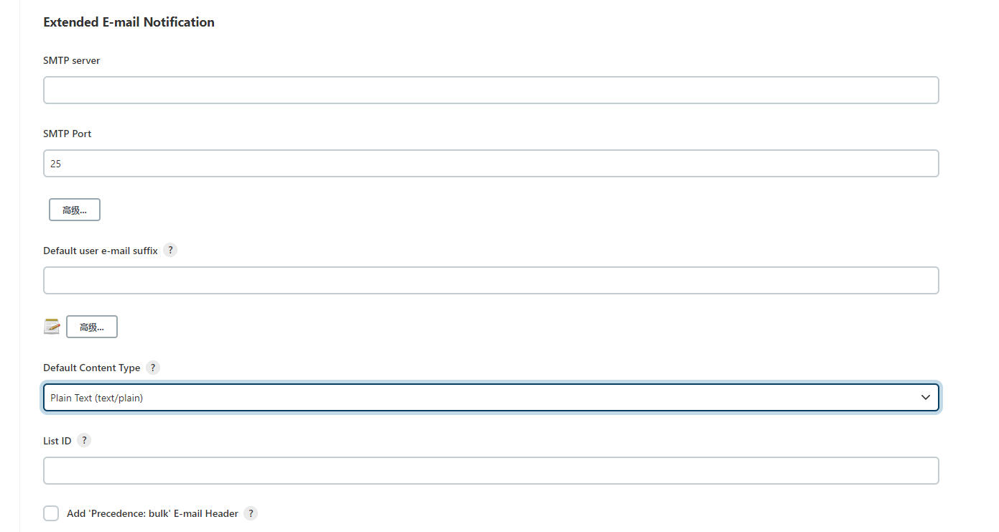

# jenkins 邮件通知及sonarqube 插件

## 邮件通知
在实际项目中往往需要在流水线执行过程中发送通知邮件到相应的开发运维人员的邮箱中，jenkins 可以通过插件 `Email Extension Plugin` 进行相关配置。
进入jenkins系统设置中找到email 相关配置：

配置内容包括邮箱服务器（参考 spring 发送邮件功能），邮箱后缀等，jenkins 旁边的问号图标都有相关配置项说明，需要注意的是jenkins 内置了一些变量，可查看 `Content Token Reference` 项。完成基本的邮件配置完成后，还需要再流水线中配置发送邮件相关信息

pipeline post

## 