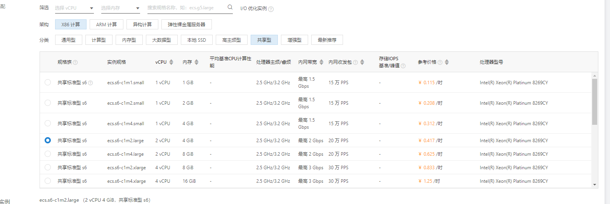

## KubeSphere 介绍

KubeSphere是k8s控制台，ubeSphere 目前提供了工作负载管理、微服务治理、DevOps 工程、Source to Image、多租户管理、多维度监控、日志查询与收集、告警通知、服务与网络、应用管理、基础设施管理、镜像管理、应用配置密钥管理等功能模块。

kubeSphere 帮我们把诸多云原生功能集中在一起并提供了web界面。利用KubeSphere我们可以根据我们之前学习的 Jenkins docker k8s 搭建一套完整的私有云系统，极大的减少运维以及开发的工作量。具体的搭建思路我在下一节中给出，这一节我们先安装并使用KubeSphere。

## kubeSphere 安装

为了简化安装，我们这里使用的是KubeKey，KubeKey安装k8s的最低配置要求是2核4G，低于这个配置使用KubeKey会安装失败。由于KubeKey会访问github。所以需要保证你的主机能联网。我们本地实验的方式可以使用前文提到过的vagrant搭建虚拟机集群。然后在vagrant中安装。也可以在云上上实验，云上实验采用按量计费的方式，阿里云收费如下，网络带宽另计费

腾讯云的：

腾讯云的服务器要便宜很多，而且阿里云要使用按量计费需要余额大于100 元，腾讯云没有这个限制，不过两家都支持余额提现。做云实验的话我建议使用腾讯云的按量计费服务器，100块钱能玩很久（它的对象存储也只要几毛钱一个月）。
阿里云和腾讯云都推出了轻量级云服务器，比普通云服务器便宜很多，这种服务器是你用多少给你分配多少，比如我买了2核4g的服务器，如果我只用了1核1g，那剩余的资源就会被系统分配出去。这种服务器做实验体验不是很好，所以没考虑，感兴趣的小伙伴可以试试这种服务器。
为了偷个懒，这次我们实验就是在腾讯云上进行（主要是本地机器网络不太好）。
执行命令：

```
export KKZONE=cn

curl -sfL https://get-kk.kubesphere.io | VERSION=v2.2.2 sh -
```


为 kk 添加可执行权限，并初始化本地主机：

```
chmod +x kk
./kk init os
```


接下来我们生成一个配置文件来安装k8s和kubeSphere

```
./kk create config [--with-kubernetes version] [--with-kubesphere version] [(-f | --file) path]
```

示例：

```
## 使用默认配置创建示例配置文件
./kk create config
## 指定要安装的 KubeSphere 版本
./kk create config --with-kubesphere v3.3.0
./kk create config --with-kubernetes v1.22.10 --with-kubesphere v3.3.0
```


这里建议指定版本号，因为有的机器会不支持安装高版本kubeSphere，指定版本生成配置文件会有对应提示。

config-sample.yaml示例：

```
apiVersion: kubekey.kubesphere.io/v1alpha2
kind: Cluster
metadata:
  name: sample
spec:
  hosts:
  - {name: node1, address: 192.168.221.128, internalAddress: 192.168.221.128, user: root, password: "root"}
  roleGroups:
    etcd:
    - node1
    control-plane: 
    - node1
    worker:
    - node1
  controlPlaneEndpoint:
    ## Internal loadbalancer for apiservers 
    # internalLoadbalancer: haproxy

    domain: lb.kubesphere.local
    address: ""
    port: 6443
  kubernetes:
    version: v1.18.6
    clusterName: cluster.local
  network:
    plugin: calico
    kubePodsCIDR: 10.233.64.0/18
    kubeServiceCIDR: 10.233.0.0/18
    ## multus support. https://github.com/k8snetworkplumbingwg/multus-cni
    multusCNI:
      enabled: false
  registry:
    plainHTTP: false
    privateRegistry: ""
    namespaceOverride: ""
    registryMirrors: []
    insecureRegistries: []
  addons: []


---
apiVersion: installer.kubesphere.io/v1alpha1
kind: ClusterConfiguration
metadata:
  name: ks-installer
  namespace: kubesphere-system
  labels:
    version: v3.0.0
spec:
  zone: ""
  local_registry: ""
  persistence:
    storageClass: ""
  authentication:
    jwtSecret: ""
  etcd:
    monitoring: true
    endpointIps: localhost
    port: 2379
    tlsEnable: true
  common:
    es:
      elasticsearchDataVolumeSize: 20Gi
      elasticsearchMasterVolumeSize: 4Gi
      elkPrefix: logstash
      logMaxAge: 7
    mysqlVolumeSize: 20Gi
    minioVolumeSize: 20Gi
    etcdVolumeSize: 20Gi
    openldapVolumeSize: 2Gi
    redisVolumSize: 2Gi
  console:
    enableMultiLogin: false  # enable/disable multi login
    port: 30880
  alerting:
    enabled: false
  auditing:
    enabled: false
  devops:
    enabled: false
    jenkinsMemoryLim: 2Gi
    jenkinsMemoryReq: 1500Mi
    jenkinsVolumeSize: 8Gi
    jenkinsJavaOpts_Xms: 512m
    jenkinsJavaOpts_Xmx: 512m
    jenkinsJavaOpts_MaxRAM: 2g
  events:
    enabled: false
    ruler:
      enabled: true
      replicas: 2
  logging:
    enabled: false
    logsidecarReplicas: 2
  metrics_server:
    enabled: true
  monitoring:
    prometheusMemoryRequest: 400Mi
    prometheusVolumeSize: 20Gi
  multicluster:
    clusterRole: none  # host | member | none
  networkpolicy:
    enabled: false
  notification:
    enabled: false
  openpitrix:
    enabled: false
  servicemesh:
    enabled: false
```

安装前配置：

```
## 指定服务器hostname
hostnamectl set-hostname master
## 关闭防火墙:
systemctl disable firewalld
## 关闭selinux:  (临时关闭 setenforce 0)
sed -i 's/enforcing/disabled/' /etc/selinux/config
## 关闭swap(临时关闭swapoff -a)
sed -ri 's/.*swap.*/#&/' /etc/fstab 

## 同步时间
yum install ntpdate -y
ntpdate time.windows.com
```

执行命令创建集群：

```
./kk create cluster -f config-sample.yaml
## 或者直接单机安装
./kk create cluster --with-kubesphere v3.0.0
```


安装过程比较耗时，中途可能出现安装失败的情况，可以使用该命令卸载再进行重装：

```
./kk delete cluster 
```

安装成功后会有如下日志：
安装完成后执行指令：

```
 kubectl get pod -A
```


根据日志访问网页：


## kubekey 指令

- 添加节点

kk add nodes -f config-sample.yaml

-  删除节点

kk delete node <nodeName> -f config-sample.yaml

- 删除集群

kk delete cluster
kk delete cluster [-f config-sample.yaml]

- 集群升级

kk upgrade [--with-kubernetes version] [--with-kubesphere version]
kk upgrade [--with-kubernetes version] [--with-kubesphere version] [(-f | --file) path]

## kubesphere 功能介绍

1）Kubernetes 资源管理
支持工作负载管理、镜像管理、服务与应用路由管理 (服务发现)、密钥配置管理等

2）微服务治理

- 支持熔断、灰度发布、流量管控、限流、链路追踪、智能路由等完善的微服务治理功能，同时，支持代码无侵入的微服务治理


3）DevOps
基于 Jenkins 的可视化 CI / CD 流水线，支持从仓库 (GitHub / SVN / Git)、代码编译、镜像制作、镜像安全、推送仓库、版本发布、到定时构建的端到端流水线设置

4）监控

5）应用管理与编排
使用开源的OpenPitrix提供应用商店和应用仓库服务，提供应用全生命周期管理功能


## 结语

k8s系列在这一篇算是终结了，下一篇会写普罗米修斯相关的文章，然后之后按照计划就是写我的 poseidon 项目了，目前对自己的要求就是一周一更新。

