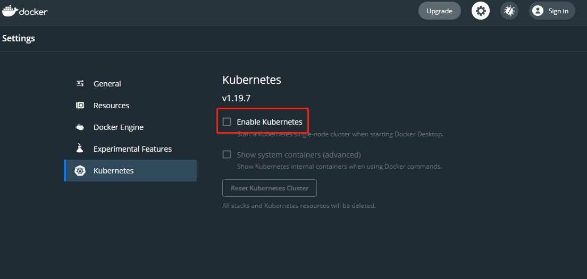

## Kubernetes中概念的简要概述

- Cluster : 集群是指由Kubernetes使用一系列的物理机、虚拟机和其他基础资源来运行你的应用程序。
- Node : 运行着Kubernetes的物理机或虚拟机，并且pod可以在其上面被调度。
- Pod : k8s的最小调度单元，一个pod 可以包含多个容器，k8s无法直接操作容器，只能操作pod
- Label : 一个label是一个被附加到资源上的键/值对，譬如附加到一个Pod上，为它传递一个用户自定的并且可识别的属性.Label还可以被应用来组织和选择子网中的资源
- selector:是一个通过匹配labels来定义资源之间关系得表达式，例如为一个负载均衡的service指定所目标Pod.
- Deployment: 控制pod生命周期的pod控制器
- Service : 一个service定义了访问pod的方式，比如固定的IP地址和与其相对应的DNS名之间的关系。
- Volume: 目录或者文件夹
- Namespace : 命名空间，起到资源分组he隔离的作用

kubernetes集群由master、node构成。其中master包含组件：

- API Server：暴露k8s api 的服务
- Scheduler：调度器，按照预定的调度策略将 Pod 调度到相应的 node 节点上。
- ControllerManager：负责维护集群的状态，比如程序部署安排、故障检测、自动扩展和滚动更新等。
- Etcd：数据库，负责存储集群中各种资源对象的信息。

node 节点包含组件：

- Kubelet：维护容器的生命周期，即通过控制 Docker ，来创建、更新、销毁容器。
- KubeProxy：提供集群内部的服务发现和负载均衡。
- Docker：容器。

## window下搭建k8s环境

搭建k8s开发环境有三种，一种是通过docker desktop + Minikube 来直接在你的电脑上搭建，这种搭建方式存在的问题比较多，很多功能不支持，不建议使用。
另外一种方式是通过Docker Desktop安装k8s，这种k8s是单机版的，master 和node 是同一个节点也就是本机，这种方式安装的k8s基本上能满足我们的学习需求，初期学习阶段可以使用这种安装方式。
还有就是通过前文介绍 vagrant 制作box 然后创建集群安装，这种安装方式是最完整也是最麻烦的。
现在先介绍第二种安装方式，第二种方式是把k8s 镜像拉取下来并运行容器，但因为国内网络的问题，镜像依赖拉不下来，我们可以上github 拉阿里云的k8s-for-docker-desktop 到本地安装。

```
	git clone https://github.com/AliyunContainerService/k8s-for-docker-desktop.git
	cd k8s-for-docker-desktop

	// 执行脚本安装K8S相关镜像（确认k8s-for-docker-desktop文件夹下的images中的k8s和本地安装的docker中需要的k8s版本保持一致）
	./load_images.sh
```
需要注意git tag 是不是和你的  docker中的k8s版本保持一致

然后打开你的docker desktop，勾选k8s:


等docker 重启后就安装完成了，打开命令行窗口执行指令，验证是否安装成功：
```
 kubectl cluster-info
```
第三种安装方式需要kubeadm 来进行集群安装，k8s集群可以一主多从或者多主多从，这里我搭建的是一主多从集群。

安装步骤：

1. 制作自己的box并配置好Vagrantfile，box中需要安装docker，更新yum源等，最好安装一些基本工具与telnet，然后启动虚拟机

2. 禁用selinux，禁用swap分区 ，selinux是linux系统下的一个安全服务，如果不关闭它，在安装集群中会产生各种各样的奇葩问题，swap分区指的是虚拟内存分区，
它的作用是物理内存使用完，之后将磁盘空间虚拟成内存来使用，启用swap设备会对系统的性能产生非常负面的影响

3. 修改linux的内核参数

```shell
# 修改linux的内核采纳数，添加网桥过滤和地址转发功能
# 编辑/etc/sysctl.d/kubernetes.conf文件，添加如下配置：
net.bridge.bridge-nf-call-ip6tables = 1
net.bridge.bridge-nf-call-iptables = 1
net.ipv4.ip_forward = 1

# 重新加载配置
[root@master ~]# sysctl -p
# 加载网桥过滤模块
[root@master ~]# modprobe br_netfilter
# 查看网桥过滤模块是否加载成功
[root@master ~]# lsmod | grep br_netfilter
```
4. 安装Kubernetes组件

```
# 1、由于kubernetes的镜像在国外，速度比较慢，这里切换成国内的镜像源
# 2、编辑/etc/yum.repos.d/kubernetes.repo,添加下面的配置
[kubernetes]
name=Kubernetes
baseurl=http://mirrors.aliyun.com/kubernetes/yum/repos/kubernetes-el7-x86_64
enabled=1
gpgchech=0
repo_gpgcheck=0
gpgkey=http://mirrors.aliyun.com/kubernetes/yum/doc/yum-key.gpg
			http://mirrors.aliyun.com/kubernetes/yum/doc/rpm-package-key.gpg

# 3、安装kubeadm、kubelet和kubectl
[root@master ~]# yum install --setopt=obsoletes=0 kubeadm-1.17.4-0 kubelet-1.17.4-0 kubectl-1.17.4-0 -y

# 4、配置kubelet的cgroup
#编辑/etc/sysconfig/kubelet, 添加下面的配置
KUBELET_CGROUP_ARGS="--cgroup-driver=systemd"
KUBE_PROXY_MODE="ipvs"

# 5、设置kubelet开机自启
[root@master ~]# systemctl enable kubelet
```

5. 准备集群镜像,利用kubeadm部署k8s的Master节点：
```
# 在安装kubernetes集群之前，必须要提前准备好集群需要的镜像，所需镜像可以通过下面命令查看
[root@master ~]# kubeadm config images list

# 由于默认拉取镜像地址k8s.gcr.io国内无法访问，这里需要指定阿里云镜像仓库地址
kubeadm init \
  --apiserver-advertise-address=局域网ip \
  --image-repository registry.aliyuncs.com/google_containers \
  --kubernetes-version v1.18.0 \
  --service-cidr=-service 的CIDR\
  --pod-network-cidr=Pod 网络的 CIDR

```
6. 配置node，当第五步执行完成，kubeadm 会输出一个指令，将这句指令复制到node节点上执行：

```
kubeadm join 192.168.18.1:8080 --token xxx \
    --discovery-token-ca-cert-hash xxx
```
7. 在master 节点上执行指令，验证安装：

```
 kubectl get nodes
```

## namespace
命名空间在k8s中的主要作用是资源隔离，可以将多个 pod 放入同一namespace中，实现对一组pod资源的管理。
k8s 在集群启动后，会默认创建几个namespace ,可以通过指令`kubectl get ns` 查看：

```
C:\Users\Administrator>kubectl get ns
NAME                   STATUS   AGE
default                Active   34d
kube-node-lease        Active   34d
kube-public            Active   34d
kube-system            Active   34d
kubernetes-dashboard   Active   34d

```

如果我们创建pod的时候未指定namespace,则会默认划分到 default 命名空间中，`kube-node-lease` 用于维护节点之间的心跳，`kube-public` 公共资源的命名空间，可以被所有人访问，`kube-system` k8s的系统资源命名空间。
查看命名空间指令：
```
kubectl get pods -n kube-system 

### 控制台返回

NAME                                     READY   STATUS    RESTARTS         AGE
coredns-78fcd69978-7df2r                 1/1     Running   41 (18m ago)     34d
coredns-78fcd69978-cwwmp                 1/1     Running   41 (18m ago)     34d
etcd-docker-desktop                      1/1     Running   41 (18m ago)     34d
kube-apiserver-docker-desktop            1/1     Running   41 (18m ago)     34d
kube-controller-manager-docker-desktop   1/1     Running   41 (18m ago)     34d
kube-proxy-5hfwt                         1/1     Running   41 (18m ago)     34d
kube-scheduler-docker-desktop            1/1     Running   41 (18m ago)     34d
storage-provisioner                      1/1     Running   81 (17m ago)     34d
vpnkit-controller                        1/1     Running   1728 (17m ago)   34d

```

namespace 相关指令：

```
### 查看 
kubectl get ns

### 查看某一个
kubectl get ns default

### 查看详情 
kubectl describe ns default

### 创建
kubectl create ns dev

### 删除 
kubectl delete ns dev

```
在namespace 属性中 status 的状态包括 active Terminating（正在删除），resource quota 属性限制了 ns的资源，limitRange resource 限制了 ns 下 pod的资源

我们还可以以配置文件的形式创建namespace，创建ns-dev.yaml:

```
apiVersion: v1
kind: Namespace
metadata:
  name: dev

```
执行对应的创建或删除命令：

```
kubectl create -f ns-dev.yaml
kubectl delete -f ns-dev.yaml

```


## pod

pod 是k8s集群进行部署管理的最小单元，一个pod中可以有一个或者多个容器，pod是对容器的封装。k8s 在集群启动后，集群中的各个组件都是以pod的方式运行的。可以通过以下命令查看：

```
kubectl get pod -n kube-system [-o wide]

### 控制台返回
C:\Users\Administrator>kubectl get pod -n kube-system
NAME                                     READY   STATUS    RESTARTS           AGE
coredns-78fcd69978-7df2r                 1/1     Running   43 (70m ago)       35d
coredns-78fcd69978-cwwmp                 1/1     Running   43 (70m ago)       35d
etcd-docker-desktop                      1/1     Running   43 (70m ago)       35d
kube-apiserver-docker-desktop            1/1     Running   43 (70m ago)       35d
kube-controller-manager-docker-desktop   1/1     Running   43 (70m ago)       35d
kube-proxy-5hfwt                         1/1     Running   43 (70m ago)       35d
kube-scheduler-docker-desktop            1/1     Running   43 (70m ago)       35d
storage-provisioner                      1/1     Running   85 (69m ago)       35d
vpnkit-controller                        1/1     Running   1770 (9m43s ago)   35d

```

pod相关指令：

```
### 运行一个pod 
kubectl run nginx --image=nginx:1.17.1 --port=80 --namespace dev

### 查看
kubectl get pod -n kube-system -o wide
kubectl describe pod nginx-xxxx -n dev

## 删除
kubectl delete pod nginx-xxxx -n dev

## 删除pod 控制器 当pod 绑定pod 控制器的时候，直接删除pod后，pod控制器会重建pod 因此需要删除对应的pod控制器
kubectl get deployment -n dev

### 删除pod 控制器
kubectl delete deployment nginx -n dev

```

通过配置文件创建pod:

```
apiVersion: v1
kind: Pod
metadata:
  name: nginx
  namespace: dev
spec:
  containers:
  - image: nginx:latest
    name: pod
    ports:
    - name: nginx-port
      containerPort: 80
      protocol: TCP
```

然后就可以执行对应的创建和删除命令了：

创建：kubectl create -f pod-nginx.yaml

删除：kubectl delete -f pod-nginx.yaml

## label

Label是kubernetes系统中的一个重要概念。它的作用就是在资源上添加标识，用来对它们进行区分和选择。

Label的特点：

- 一个Label会以key/value键值对的形式附加到各种对象上，如Node、Pod、Service等等
- 一个资源对象可以定义任意数量的Label ，同一个Label也可以被添加到任意数量的资源对象上去
- Label通常在资源对象定义时确定，当然也可以在对象创建后动态添加或者删除

可以通过Label实现资源的多维度分组，以便灵活、方便地进行资源分配、调度、配置、部署等管理工作。

> 一些常用的Label 示例如下：
>
> - 版本标签："version":"release", "version":"stable"......
> - 环境标签："environment":"dev"，"environment":"test"，"environment":"pro"
> - 架构标签："tier":"frontend"，"tier":"backend"


打标签命令
```
kubectl get pod -n dev --show-labels
kubectl label pod nginx -n dev version=1.0 
kubectl label pod nginx -n dev version=2.0 --overwrite
kubectl label pod -l "version=2.0" -n dev

## 删除标签 
kubectl label pod nginx -n dev version-

# pod 更新
kubectl apply -f nginx.yaml
```

配置文件打标签

```
apiVersion: v1
kind: Pod
metadata:
  name: nginx
  namespace: dev
  labels:
    version: "3.0" 
    env: "test"
spec:
  containers:
  - image: nginx:latest
    name: pod
    ports:
    - name: nginx-port
      containerPort: 80
      protocol: TCP
```

在pod的yaml 中指定标签然后通过指令：
```
kubectl apply -f nginx.yaml
```
完成更新


## deployment


在kubernetes中，Pod是最小的控制单元，但是kubernetes很少直接控制Pod，一般都是通过Pod控制器来完成的。Pod控制器用于pod的管理，确保pod资源符合预期的状态，当pod的资源出现故障时，会尝试进行重启或重建pod。

在kubernetes中Pod控制器的种类有很多，本章节只介绍一种：Deployment。

```
## 查看deployment pod
kubectl get deployment,pods -n dev
# 命令格式: kubectl create deployment 名称  [参数] 
# --image  指定pod的镜像
# --port   指定端口
# --replicas  指定创建pod数量
# --namespace  指定namespace
[root@master ~]# kubectl run nginx --image=nginx:latest --port=80 --replicas=3 -n dev
deployment.apps/nginx created

# 查看创建的Pod
[root@master ~]# kubectl get pods -n dev
NAME                     READY   STATUS    RESTARTS   AGE
nginx-5ff7956ff6-6k8cb   1/1     Running   0          19s
nginx-5ff7956ff6-jxfjt   1/1     Running   0          19s
nginx-5ff7956ff6-v6jqw   1/1     Running   0          19s

# 查看deployment的信息
[root@master ~]# kubectl get deploy -n dev
NAME    READY   UP-TO-DATE   AVAILABLE   AGE
nginx   3/3     3            3           2m42s

# UP-TO-DATE：成功升级的副本数量
# AVAILABLE：可用副本的数量
[root@master ~]# kubectl get deploy -n dev -o wide
NAME    READY UP-TO-DATE  AVAILABLE   AGE     CONTAINERS   IMAGES              SELECTOR
nginx   3/3     3         3           2m51s   nginx        nginx:latest        run=nginx

# 查看deployment的详细信息
[root@master ~]# kubectl describe deploy nginx -n dev
Name:                   nginx
Namespace:              dev
CreationTimestamp:      Wed, 08 May 2021 11:14:14 +0800
Labels:                 run=nginx
Annotations:            deployment.kubernetes.io/revision: 1
Selector:               run=nginx
Replicas:               3 desired | 3 updated | 3 total | 3 available | 0 unavailable
StrategyType:           RollingUpdate
MinReadySeconds:        0
RollingUpdateStrategy:  25% max unavailable, 25% max surge
Pod Template:
  Labels:  run=nginx
  Containers:
   nginx:
    Image:        nginx:latest
    Port:         80/TCP
    Host Port:    0/TCP
    Environment:  <none>
    Mounts:       <none>
  Volumes:        <none>
Conditions:
  Type           Status  Reason
  ----           ------  ------
  Available      True    MinimumReplicasAvailable
  Progressing    True    NewReplicaSetAvailable
OldReplicaSets:  <none>
NewReplicaSet:   nginx-5ff7956ff6 (3/3 replicas created)
Events:
  Type    Reason             Age    From                   Message
  ----    ------             ----   ----                   -------
  Normal  ScalingReplicaSet  5m43s  deployment-controller  Scaled up replicaset nginx-5ff7956ff6 to 3
  
# 删除 
[root@master ~]# kubectl delete deploy nginx -n dev
deployment.apps "nginx" deleted
```

配置文件创建：
```
apiVersion: apps/v1
kind: Deployment
metadata:
  name: nginx
  namespace: dev
spec:
  replicas: 3
  selector:
    matchLabels:
      run: nginx
  template:
    metadata:
      labels:
        run: nginx
    spec:
      containers:
      - image: nginx:latest
        name: nginx
        ports:
        - containerPort: 80
          protocol: TCP
```

## service
通过上节课的学习，已经能够利用Deployment来创建一组Pod来提供具有高可用性的服务。

虽然每个Pod都会分配一个单独的Pod IP，然而却存在如下两问题：

- Pod IP 会随着Pod的重建产生变化
- Pod IP 仅仅是集群内可见的虚拟IP，外部无法访问

这样对于访问这个服务带来了难度。因此，kubernetes设计了Service来解决这个问题。

Service可以看作是一组同类Pod**对外的访问接口**。借助Service，应用可以方便地实现服务发现和负载均衡。


```
# 暴露Service
[root@master ~]# kubectl expose deploy nginx --name=svc-nginx1 --type=ClusterIP --port=80 --target-port=80 -n dev
service/svc-nginx1 exposed

# 查看service
[root@master ~]# kubectl get svc svc-nginx1 -n dev -o wide
NAME         TYPE        CLUSTER-IP       EXTERNAL-IP   PORT(S)   AGE     SELECTOR
svc-nginx1   ClusterIP   10.109.179.231   <none>        80/TCP    3m51s   run=nginx

```