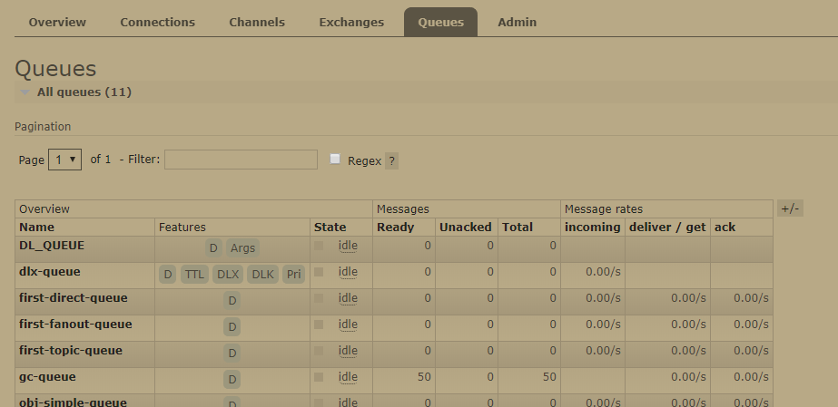

从这一节开始我们进入rabbitMQ的实战环节，项目环境是spring-boot 加maven。首先让我们创建一个spring-boot项目，然后引入web依赖和 rabbitMQ的依赖
<!--more-->
```xml
 <dependency>
    <groupId>org.springframework.boot</groupId>
    <artifactId>spring-boot-starter-amqp</artifactId>
 </dependency>
 <dependency>
    <groupId>org.springframework.boot</groupId>
    <artifactId>spring-boot-starter-web</artifactId>
  </dependency>
```

application.properties

```properties
spring.rabbitmq.host=localhost
spring.rabbitmq.username=guest
spring.activemq.password=guest
```

环境搭建好之后我们就可以开始进行实战操作了。

## 简单消息队列

springboot会默认为你创建一个`direct exchange`类型交换机，其名称为`""`空字符串，其路由键和绑定键都是队列名称，未指定交换机的队列都会绑定到这个交换机上去。我们就以这个最简单的消息队列开始来学习如何在项目中使用`rabbitMQ`。

我们先注册两个队列，一个用于传递String类型消息，一个传递Object类型的数据。项目启动后springboot会为你在 rabbitMQ 中创建两个队列，启动项目后打开 rabbitMQ 的 web 管理界面（以下简称管理界面）会在 Queues 中看到这两个队列的相关信息。

```java
@Component
public class QueueConfig {
    @Bean
    public Queue getSimpleQueue() {
        return new Queue("simple-queue");
    }

    @Bean
    public Queue getObjSimpleQueue() {
        return new Queue("obj-simple-queue");
    }
}
```

创建两个定时任务，向 rabbitMQ 投递消息，注意这里需要在启动类上加 `@EnableScheduling` 注解以启动定时任务，而 `Message` 是我创建的实体类：

```java
@Component
public class ScheduleHandler {
    @Autowired
    private RabbitTemplate rabbitTemplate;

    @Scheduled(fixedRate = 6000)
    private void simpleQueueSchedule() {
        System.out.println("<<<<<<<<<<");

        rabbitTemplate.convertAndSend("simple-queue","ni----hao");
    }

    @Scheduled(fixedRate = 6000)
    private void objSimpleQueueSchedule() {
        System.out.println("<<<<<<<<<<");
        Message message = new Message();
        message.setTitle("hello");
        message.setContent("how are you ");
        rabbitTemplate.convertAndSend("obj-simple-queue",message);
    }

}
```

消费者消费消息：

```java
@Component
public class QueueMessageHandler {

    @RabbitListener(queues = { "simple-queue"})
    public void getSimpleQueueMessage(String msg){
        System.out.println(msg);
    }

    @RabbitListener(queues = { "obj-simple-queue"})
    public void getObjSimpleQueueMessage(Message msg){
        System.out.println(msg);
    }

}
```

`rabbitTemplate.convertAndSend()`方法是将数据序列化并写入队列中，而其使用的序列化协议自然是java序列化协议（使用 `ObjectInputStream` 和 `ObjectOutputStream` 读写），因此你如果调用这个方法则其实体类需要实现`Serializable`接口，而如果跨虚拟机还需要注意 `serialVersionUID`。如果跨平台了，那么最好使用其他序列化的方式,序列化反序列化配置在后文关于**监听器容器**的章节介绍。

## 推模式和拉模式

对消费端而言使用`@RabbitListener`监听器获取MQ消息的方式称为`推模式`，我们还可以使用拉模式，当我们需要一条消息的时候才从队列中拉一条消息出来，使用的方法为 `rabbitTemplate.receiveAndConvert()`，如：

```
  Message o = ((Message) rabbitTemplate.receiveAndConvert("obj-simple-queue"));
```

##  direct exchange 直连交换机

直连交换机，需要注册一个 `DirectExchange` , `Queue` , `Binding` 。`Bingding` 负责将 `DirectExchange` 和 `Queue` 绑定并指定 `routingKey` 生产者生产消息的时候也需要指定 `routingKey`。下面看示例：

```java
//  生产端配置
    @Bean("directQueueFirst")
    public Queue directQueueFirst() {
        return new Queue("first-direct-queue");
    }

    @Bean("directQueueSecond")
    public Queue directQueueSecond() {
        return QueueBuilder.durable("second-direct-queue").build();
    }
    @Bean("directExchange")
    public DirectExchange directExchange() {
        return new DirectExchange("direct-exchange");
    }
    
    @Bean
    public Binding bingQueueFirstToDirect(@Qualifier("directQueueFirst") Queue queue, 		@Qualifier("directExchange") DirectExchange exchange) {
        return BindingBuilder.bind(queue).to(exchange).with("first-key");
    }

    @Bean
    public Binding bingQueueSecondToDirect(@Qualifier("directQueueSecond") Queue queue, @Qualifier("directExchange") DirectExchange exchange) {
        return BindingBuilder.bind(queue).to(exchange).with("second-key");
    }
    
//  生产者发送消息
@Component
public class ScheduleHandler {

    @Scheduled(fixedRate = 6000)
    private void directMessageScheduleFirst() {
        Message message = new Message();
        message.setTitle("hello");
        message.setContent("how are you for direct first");
        rabbitTemplate.convertAndSend("direct-exchange","first-key",message);
    }

    @Scheduled(fixedRate = 6000)
    private void directMessageScheduleSecond() {
        Message message = new Message();
        message.setTitle("hello");
        message.setContent("how are you for direct second");
        rabbitTemplate.convertAndSend("topic-exchange","second-key",message);
    }
}
@Component
public class QueueMessageHandler {
//  消费端
    @RabbitListener(queues = { "first-direct-queue"})
    public void firstDirectMessageQueue(Message msg){
        System.out.println(msg);
    }

    @RabbitListener(queues = { "second-direct-queue"})
    public void secondDirectMessageQueue(Message msg){
        System.out.println(msg);
    }
}
```

值得注意的是，springboot为了使我们的代码可读性更好，还非常贴心的提供 `Exchange`,`Binding`,`Queue`的`Builder`（建造者），因此你可以使用它们对应建造者，也可以使用直接 new 的方式进行创建。另外创建的这些 exchange queue 都能在管理界面上看到，如图 2 ，图 3 ：



​											图 2：队列信息


​										图 3：交换机信息

##  fanout exchange  扇型交换机

使用上和 direct exchange 大同小异，只不过不需要指定路由键，而且所有和它绑定的队列都会收到消息，直接上代码：

```java
// 生产者配置
    @Bean("fanoutQueueFirst")
    public Queue fanoutQueueFirst() {
        return new Queue("first-fanout-queue");
    }

    @Bean("fanoutQueueSecond")
    public Queue fanoutQueueSecond() {
        return new Queue("second-fanout-queue");
    }

    @Bean("fanoutExchange")
    public FanoutExchange fanoutExchange() {
        return new FanoutExchange("fanout-exchange");
    }

    @Bean
    public Binding bingQueueFirstToExchange(@Qualifier("fanoutQueueFirst") Queue queue, @Qualifier("fanoutExchange") FanoutExchange exchange) {
        return BindingBuilder.bind(queue).to(exchange);
    }

    @Bean
    public Binding bingQueueSecondToExchange(@Qualifier("fanoutQueueSecond") Queue queue, @Qualifier("fanoutExchange") FanoutExchange exchange) {
        return BindingBuilder.bind(queue).to(exchange);
    }
@Component
public class ScheduleHandler {
//  生产者发消息，注意这里虽然填了routingKey 但是是无效的
    @Scheduled(fixedRate = 6000)
    private void directMessageScheduleFirst() {
        Message message = new Message();
        message.setTitle("hello");
        message.setContent("how are you for direct first");
        rabbitTemplate.convertAndSend("direct-exchange","first-key",message);
    }
}
//  消费者，两个队列都能收到同一份消息
@Component
public class QueueMessageHandler {
    @RabbitListener(queues = { "first-fanout-queue"})
    public void firstFanoutQueue(Message msg){
        System.out.println(msg);
    }

    @RabbitListener(queues = { "second-fanout-queue"})
    public void secondFanoutQueue(Message msg){
        System.out.println(msg);
    }
}
```

##  主题交换机  Topic

前文介绍了主题交换机的路由方式，注意我代码中的路由键设置，这里我设置两个`bingding-key` 分别是 `com.muggle.first` 和 `com.#` 我用 `routing-key` 为 `com.muggle.test` 发消息这两个队列都能接收到

```java
    @Bean("topicQueueFirst")
    public Queue topicQueueFirst() {
        return new Queue("first-topic-queue");
    }

    @Bean("topicQueueSecond")
    public Queue topicQueueSecond() {
        return new Queue("second-topic-queue");
    }

    @Bean
    public Binding bindTopicFirst(@Qualifier("topicQueueFirst") Queue queue, @Qualifier("topicExchange") TopicExchange exchange) {
        return BindingBuilder.bind(queue).to(exchange).with("com.muggle.first");
    }

    @Bean
    public Binding bindTopicSecond(@Qualifier("topicQueueFirst") Queue queue, @Qualifier("topicExchange") TopicExchange exchange) {
        return BindingBuilder.bind(topicQueueFirst()).to(topicExchange()).with("com.#");
    }
    
@Component
public class ScheduleHandler {
    @Scheduled(fixedRate = 6000)
    private void topicMessage() {
        Message message = new Message();
        message.setTitle("hello");
        message.setContent("how are you for topic test");
        rabbitTemplate. convertAndSend("topic-exchange","com.muggle.test",message);
    }
    
}

@Component
public class QueueMessageHandler {
    @RabbitListener(queues = { "first-topic-queue"})
    public void firstTopicMessageQueue(Message msg){
        System.out.println(msg);
    }

    @RabbitListener(queues = { "second-topic-queue"})
    public void secondTopicMessageQueue(Message msg){
        System.out.println(msg);
    }
}


```
现在我们学习了 rabbitMQ 的各类交换机的用法，这些只是 rabbitMQ 的基础特性，下文我们将介绍一些 rabbitMQ 的更复杂的使用方法。

项目源码：https://github.com/muggle0/learn-simple.git

---

作者：muggle [点我关注作者](https://muggle.javaboy.org/2019/03/20/home/) 

出处：https://muggle-book.gitee.io/

版权：本文版权归作者所有 

转载：欢迎转载，但未经作者同意，必须保留此段声明；必须在文章中给出原文连接；否则必究法律责任