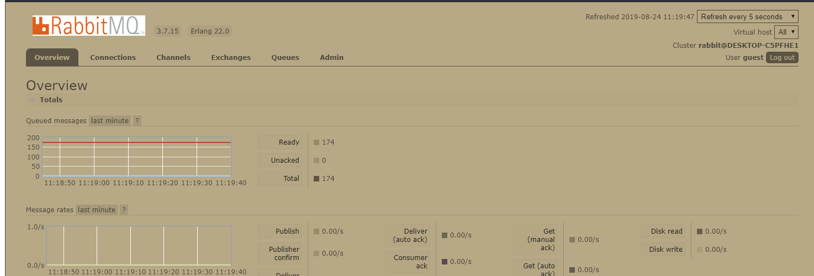
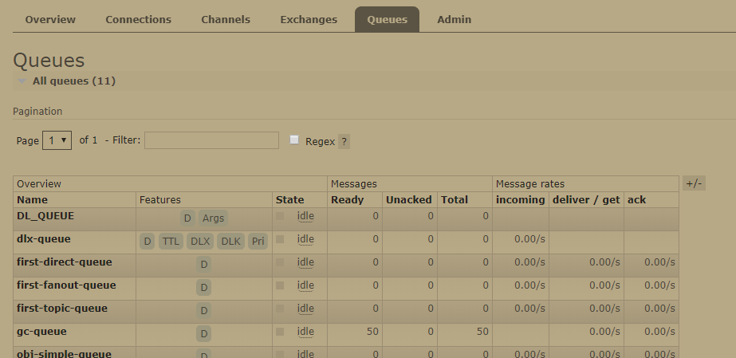
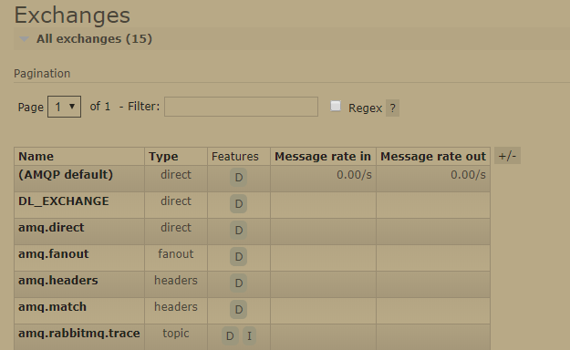

## 1. rabbitMQ简介

`rabbitMQ`是基于`AMQP`协议的消息中间件，即`Advanced Message Queuing Protocol`，高级消息队列协议，是应用层协议的一个开放标准，为面向消息的中间件设计。消息中间件主要用于组件之间的解耦，消息的发送者无需知道消息使用者的存在，反之亦然。 AMQP的主要特征是面向消息、队列、路由（包括点对点和发布/订阅）。基于AMQP协议的消息中间件还有`kafka`，`rocketMQ`等。还有另外一类基于jms协议的消息中间件（如activeMQ），这类MQ相对AMQP来说扩展性有所不足，因此大部分公司都会选择AMQP产品。而rabbitMQ以其安装部署简单，上手门槛低，功能丰富，集群易扩展，有强大的WEB管理页面，消息可靠投递机制等优点受广大开发人员欢迎。

介绍了这么多，或许有的小伙伴还是不太明白MQ的使用场景，MQ作用就六个字——异步，削峰，解耦。它在大型电子商务类网站，如京东、淘宝、去哪儿等网站有着深入的应用。比如一个下单流程，在不使用消息队列的情况下，用户的请求数据直接写入数据库，在高并发的情况下，会对数据库造成巨大的压力，同时也使得系统响应延迟加剧。在使用队列后，用户的请求发给队列后立即返回，后续处理交给队列，在业务逻辑上只需要做简单修改即可（如告诉用户系统确认订单中，等MQ处理完再更新订单状态），这只是一个简单的使用场景，MQ的用武之地还很多。


<!--more-->

## 2. rabbitMQ成员角色

学习rabbtMQ我们先要弄清楚这几个概念：`exchange`,`queue`,`routing-key`,`binding-key`,`message`,`publisher`,`exchange`,`binding-key`,`Connection`,`Channel`,`consumer`,`broker`；下面对这些角色概念进行介绍。

消息的发送方被称作`publisher`（生产者），而消息的接收方被称作`consumer`(消费者)，而消息队列服务器实体就是`broker`（指`rabbitMQ`）；消费者或者生产者对rabbitMQ的一个连接被称作`Connection`（连接）,在rabbit的连接模型中，为了提高连接传输效率，采用了`Channel`（管道）这种方式实现多路复用，类似于Nio中的模型；我们知道建立一个TCP连接代价很大，因此TCP连接建立后最好不要断开`Connection`-`Channel`连接模型就是为了达到这种目的；一个消费者（生产者）使用一个`channel`消费（发送）消息，而多个`Channel`共用一个`Connection`。

一个生产者向rabbit投递消息，然后消费者消费这个消息的过程是这样的——生产者将消息投递给rabbit，在rabbit中`exchange`（交换机）首先会接收到这个消息，交换机相当于一个“分拣员”的角色，负责分拣消息，将这些消息存储到和自己绑定的`queue`（队列）中去，然后和队列绑定的消费者会消费这些消息。队列和交换机绑定通过一个`binding-key`（绑定键）来标记，而生产者投递消息给交换机的时候会指定一个`routing-key`（路由键），而交换机会根据路由和绑定键来判断将消息放到那些队列中去（扩展：kafka的数据是存储在 exchange 中，它的 queue 只是逻辑队列）。

在rabbit中交换机共有四种类型，下面对其类型和其消息路由规则做说明：

- `direct exchange`(直连交换机)：消息中的`routing-key`如果和`binding-key`一致， 交换器就将消息发到对应的队列中,`routing-key`要与`binding-key`完全匹配。
- `fanout exchange`(扇型交换机):扇型交换机会将交给自己的消息发到所有和自己绑定的队列中去，它不会去匹配`routing-key`和`binding-key`。
- `topic exchange`(主题交换机):主题交换机的`routing-key`匹配`binding-key`的方式支持模糊匹配， 以.分割单词，`*`匹配一个单词，`#`匹配多个单词，比如如路由键是`com.muggle.first` 能被`com.#`和`*.muggle.*`绑定键匹配。
- `headers exchange`(头交换机):类似主题交换机，但是头交换机使用多个消息属性来代替路由键建立路由规则。通过判断消息头的值能否与指定的绑定相匹配来确立路由规则。当交换机的`x-match`属性为`any`时，消息头的任意一个值被匹配就可以满足条件,当为`all`的时候，就需要消息头的所有值都匹配成功,这种交换机在实际生产中用的并不多。

## 3. springboot+rabbitMQ 使用案例

本文的demo已经放到github上去了，有需要的小伙伴可以去拉下来（顺便求个star），地址： `https://github.com/muggle0/learn-simple`。运行本项目之前请先安装好`rabbitMQ`，用`docker`安装的话，一个命令就搞定了，如果安装在windows上需要注意这几个坑——1.确保`Erlang`安装成功（安装过程中会提示），2.rabbitMQ的web管理插件需要另外安装，3. 注意用户权限配置。小伙伴可以参考这篇博客：`https://www.cnblogs.com/lykbk/p/erewererewr32434343.html`。这一节主要介绍怎么在springboot中集成使用rabbitMQ。后续章节会介绍，交换机、队列、消息等角色相关参数如何在项目中配置使用。

在正式使用前我们先来瞅瞅rabbitMQ的web管理界面，访问`http://localhost:15672/#/`登录后，你会看到`图1`这些东西：`Overview` 是对rabbitMQ整体情况统计的界面，`Connections`是对连接进行管理的界面，`Queues`是队列管理界面，`Admin`是用户管理界面，以此类推。



​										图 1：rabbit的web管理界面

### 3.1  简单消息队列

springboot会默认为你创建一个`direct exchange`类型交换机，其名称为`""`空字符串，其路由键和绑定键都是队列名称，未指定交换机的队列都会绑定到这个交换机上去。我们就以这个最简单的消息队列开始来学习如何在项目中使用`rabbitMQ`。依赖如下：

```xml
 <dependency>
    <groupId>org.springframework.boot</groupId>
    <artifactId>spring-boot-starter-amqp</artifactId>
 </dependency>
 <dependency>
    <groupId>org.springframework.boot</groupId>
    <artifactId>spring-boot-starter-web</artifactId>
    </dependency>

 <dependency>
    <groupId>org.projectlombok</groupId>
    <artifactId>lombok</artifactId>
    <optional>true</optional>
 </dependency>

 <dependency>
    <groupId>org.apache.commons</groupId>
    <artifactId>commons-text</artifactId>
    <version>1.2</version>
 </dependency>

 <dependency>
    <groupId>org.springframework.boot</groupId>
    <artifactId>spring-boot-starter-test</artifactId>
    <scope>test</scope>
 </dependency>
```

properties:

```properties
spring.rabbitmq.host=localhost
spring.rabbitmq.username=guest
spring.activemq.password=guest
```

注册两个交换机，一个用于传递String类型消息，一个传递Object类型的数据。项目启动后springboot会为你在 rabbitMQ 中创建两个队列，启动项目后打开 rabbitMQ 的 web 管理界面（以下简称管理界面）会在 Queues 中看到这两个队列的相关信息。

```java
@Component
public class QueueConfig {
    @Bean
    public Queue getSimpleQueue() {
        return new Queue("simple-queue");
    }

    @Bean
    public Queue getObjSimpleQueue() {
        return new Queue("obj-simple-queue");
    }
}
```

创建两个定时任务，向 rabbitMQ 投递消息，注意这里需要在启动类上加 `@EnableScheduling` 注解以启动定时任务，而 `Message` 是我创建的实体类：

```java
@Component
public class ScheduleHandler {
    @Autowired
    private RabbitTemplate rabbitTemplate;

    @Scheduled(fixedRate = 6000)
    private void simpleQueueSchedule() {
        System.out.println("<<<<<<<<<<");

        rabbitTemplate.convertAndSend("simple-queue","ni----hao");
    }

    @Scheduled(fixedRate = 6000)
    private void objSimpleQueueSchedule() {
        System.out.println("<<<<<<<<<<");
        Message message = new Message();
        message.setTitle("hello");
        message.setContent("how are you ");
        rabbitTemplate.convertAndSend("obj-simple-queue",message);
    }

}
```

消费者消费消息：

```java
@Component
public class QueueMessageHandler {

    @RabbitListener(queues = { "simple-queue"})
    public void getSimpleQueueMessage(String msg){
        System.out.println(msg);
    }

    @RabbitListener(queues = { "obj-simple-queue"})
    public void getObjSimpleQueueMessage(Message msg){
        System.out.println(msg);
    }

}
```

`rabbitTemplate.convertAndSend()`方法是将数据序列化并写入队列中，而其使用的序列化协议自然是java序列化协议（使用 `ObjectInputStream` 和 `ObjectOutputStream` 读写），因此你如果调用这个方法则其实体类需要实现`Serializable`接口，而如果跨虚拟机还需要注意 `serialVersionUID`。如果跨平台了，那么最好使用其他序列化的方式,序列化反序列化配置在后文关于**监听器容器**的章节介绍。

### 3.2  推模式和拉模式

对消费端而言使用`@RabbitListener`监听器获取MQ消息的方式称为`推模式`，我们还可以使用拉模式，当我们需要一条消息的时候才从队列中拉一条消息出来，使用的方法为 `rabbitTemplate.receiveAndConvert()`，如：

```
  Message o = ((Message) rabbitTemplate.receiveAndConvert("obj-simple-queue"));
```

### 3.3  direct exchange 直连交换机

直连交换机，需要注册一个 `DirectExchange` , `Queue` , `Binding` 。`Bingding` 负责将 `DirectExchange` 和 `Queue` 绑定并指定 `routingKey` 生产者生产消息的时候也需要指定 `routingKey`。下面看示例：

```java
//  生产端配置
    @Bean("directQueueFirst")
    public Queue directQueueFirst() {
        return new Queue("first-direct-queue");
    }

    @Bean("directQueueSecond")
    public Queue directQueueSecond() {
        return QueueBuilder.durable("second-direct-queue").build();
    }
    @Bean("directExchange")
    public DirectExchange directExchange() {
        return new DirectExchange("direct-exchange");
    }
    
    @Bean
    public Binding bingQueueFirstToDirect(@Qualifier("directQueueFirst") Queue queue, 		@Qualifier("directExchange") DirectExchange exchange) {
        return BindingBuilder.bind(queue).to(exchange).with("first-key");
    }

    @Bean
    public Binding bingQueueSecondToDirect(@Qualifier("directQueueSecond") Queue queue, @Qualifier("directExchange") DirectExchange exchange) {
        return BindingBuilder.bind(queue).to(exchange).with("second-key");
    }
    
//  生产者发送消息
@Component
public class ScheduleHandler {

    @Scheduled(fixedRate = 6000)
    private void directMessageScheduleFirst() {
        Message message = new Message();
        message.setTitle("hello");
        message.setContent("how are you for direct first");
        rabbitTemplate.convertAndSend("direct-exchange","first-key",message);
    }

    @Scheduled(fixedRate = 6000)
    private void directMessageScheduleSecond() {
        Message message = new Message();
        message.setTitle("hello");
        message.setContent("how are you for direct second");
        rabbitTemplate.convertAndSend("topic-exchange","second-key",message);
    }
}
@Component
public class QueueMessageHandler {
//  消费端
    @RabbitListener(queues = { "first-direct-queue"})
    public void firstDirectMessageQueue(Message msg){
        System.out.println(msg);
    }

    @RabbitListener(queues = { "second-direct-queue"})
    public void secondDirectMessageQueue(Message msg){
        System.out.println(msg);
    }
}
```

值得注意的是，springboot为了使我们的代码可读性更好，还非常贴心的提供 `Exchange`,`Binding`,`Queue`的`Builder`（建造者），因此你可以使用它们对应建造者，也可以使用直接 new 的方式进行创建。另外创建的这些 exchange queue 都能在管理界面上看到，如图 2 ，图 3 ：



​											图 2：队列信息



​										图 3：交换机信息

### 3.4  fanout exchange  扇型交换机

使用上和 direct exchange 大同小异，只不过不需要指定路由键，而且所有和它绑定的队列都会收到消息，直接上代码：

```java
// 生产者配置
    @Bean("fanoutQueueFirst")
    public Queue fanoutQueueFirst() {
        return new Queue("first-fanout-queue");
    }

    @Bean("fanoutQueueSecond")
    public Queue fanoutQueueSecond() {
        return new Queue("second-fanout-queue");
    }

    @Bean("fanoutExchange")
    public FanoutExchange fanoutExchange() {
        return new FanoutExchange("fanout-exchange");
    }

    @Bean
    public Binding bingQueueFirstToExchange(@Qualifier("fanoutQueueFirst") Queue queue, @Qualifier("fanoutExchange") FanoutExchange exchange) {
        return BindingBuilder.bind(queue).to(exchange);
    }

    @Bean
    public Binding bingQueueSecondToExchange(@Qualifier("fanoutQueueSecond") Queue queue, @Qualifier("fanoutExchange") FanoutExchange exchange) {
        return BindingBuilder.bind(queue).to(exchange);
    }
@Component
public class ScheduleHandler {
//  生产者发消息，注意这里虽然填了routingKey 但是是无效的
    @Scheduled(fixedRate = 6000)
    private void directMessageScheduleFirst() {
        Message message = new Message();
        message.setTitle("hello");
        message.setContent("how are you for direct first");
        rabbitTemplate.convertAndSend("direct-exchange","first-key",message);
    }
}
//  消费者，两个队列都能收到同一份消息
@Component
public class QueueMessageHandler {
    @RabbitListener(queues = { "first-fanout-queue"})
    public void firstFanoutQueue(Message msg){
        System.out.println(msg);
    }

    @RabbitListener(queues = { "second-fanout-queue"})
    public void secondFanoutQueue(Message msg){
        System.out.println(msg);
    }
}
```

### 3.5  主题交换机  Topic

前文介绍了主题交换机的路由方式，注意我代码中的路由键设置，这里我设置两个`bingding-key` 分别是 `com.muggle.first` 和 `com.#` 我用 `routing-key` 为 `com.muggle.test` 发消息这两个队列都能接收到

```java
    @Bean("topicQueueFirst")
    public Queue topicQueueFirst() {
        return new Queue("first-topic-queue");
    }

    @Bean("topicQueueSecond")
    public Queue topicQueueSecond() {
        return new Queue("second-topic-queue");
    }

    @Bean
    public Binding bindTopicFirst(@Qualifier("topicQueueFirst") Queue queue, @Qualifier("topicExchange") TopicExchange exchange) {
        return BindingBuilder.bind(queue).to(exchange).with("com.muggle.first");
    }

    @Bean
    public Binding bindTopicSecond(@Qualifier("topicQueueFirst") Queue queue, @Qualifier("topicExchange") TopicExchange exchange) {
        return BindingBuilder.bind(topicQueueFirst()).to(topicExchange()).with("com.#");
    }
    
@Component
public class ScheduleHandler {
    @Scheduled(fixedRate = 6000)
    private void topicMessage() {
        Message message = new Message();
        message.setTitle("hello");
        message.setContent("how are you for topic test");
        rabbitTemplate. convertAndSend("topic-exchange","com.muggle.test",message);
    }
    
}

@Component
public class QueueMessageHandler {
    @RabbitListener(queues = { "first-topic-queue"})
    public void firstTopicMessageQueue(Message msg){
        System.out.println(msg);
    }

    @RabbitListener(queues = { "second-topic-queue"})
    public void secondTopicMessageQueue(Message msg){
        System.out.println(msg);
    }
}


```

好了，三种常用交换机的使用已经介绍完毕；有疑问的小伙伴可以在评论区留言探讨。关于队列和交换机的进阶使用技巧，且听下回分解。

