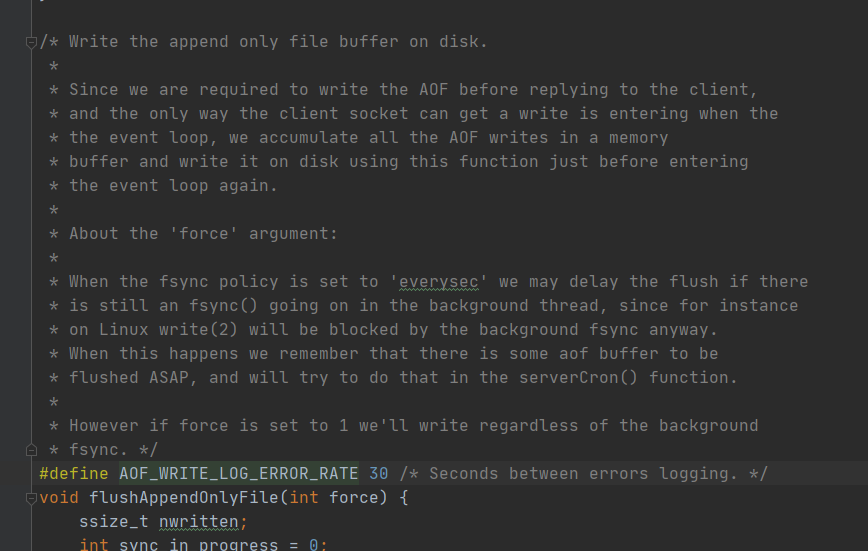

redis持久化方式有两种，一种是RDB，一种是aof。
RDB持久化是指在指定的时间间隔内将内存中的数据集快照写入磁盘。
AOF持久化以日志的形式记录服务器所处理的每一个写操作，查询操作不会记录，以文本的方式记录，可以打开文件看到详细的操作记录。

## RDB
有两个Redis命令可以用于生成RDB文件--SAVE和BGSAVE。SAVE命令会阻塞Redis服务器进程，直到RDB文件创建完毕为止，在服务器进程阻塞期间，服务器不能处理任何命令请求。

和SAVE命令直接阻塞服务器进程的做法不同，BGSAVE命令fork一个子进程，然后由子进程负责创建RDB文件，服务器进程继续处理命令请求。

创建RDB文件的实际工作由rdb.c/rdbSave函数完成，SAVE命令和BGSAVE命令会以不同的方式调用这个函数，源码：

```
/* Save the DB on disk. Return C_ERR on error, C_OK on success. */
int rdbSave(char *filename, rdbSaveInfo *rsi) {
    // 当前工作目录
    char tmpfile[256];
    char cwd[MAXPATHLEN]; /* Current working dir path for error messages. */
    FILE *fp;
    rio rdb;
    int error = 0;
    // 生成tmp文件
    snprintf(tmpfile,256,"temp-%d.rdb", (int) getpid());
    fp = fopen(tmpfile,"w");
    if (!fp) {
        char *cwdp = getcwd(cwd,MAXPATHLEN);
        serverLog(LL_WARNING,
            "Failed opening the RDB file %s (in server root dir %s) "
            "for saving: %s",
            filename,
            cwdp ? cwdp : "unknown",
            strerror(errno));
        return C_ERR;
    }
    // 初始化rio 结构
    rioInitWithFile(&rdb,fp);
    if (rdbSaveRio(&rdb,&error,RDB_SAVE_NONE,rsi) == C_ERR) {
        errno = error;
        goto werr;
    }

    /* Make sure data will not remain on the OS's output buffers */
    if (fflush(fp) == EOF) goto werr;
    if (fsync(fileno(fp)) == -1) goto werr;
    if (fclose(fp) == EOF) goto werr;

    /* Use RENAME to make sure the DB file is changed atomically only
     * if the generate DB file is ok. */
    if (rename(tmpfile,filename) == -1) {
        // 异常处理逻辑
        .... 
    }

    serverLog(LL_NOTICE,"DB saved on disk");
    // 清理数据保存记录
    server.dirty = 0;
    // 最后一次完成 SAVE 命令的时间
    server.lastsave = time(NULL);
    // 最后一次 bgsave 的状态置位 成功
    server.lastbgsave_status = C_OK;
    return C_OK;
    // 其他代码
    ....
}

```

它的大致流程如下：

1. 首先打开一个临时文件，
2. 调用 rdbSaveRio函数，将当前 Redis 的内存信息写入到这个临时文件中，
3. 接着调用 fflush、fsync 和 fclose 接口将文件写入磁盘中，
4. 使用 rename 将临时文件改名为 正式的 RDB 文件，
5. 最后记录 dirty 和 lastsave等状态信息。

RDB文件保存的是二进制数据，文件结构如图所示：


RDB文件的最开头是REDIS部分，保存着“REDIS”五个字符，程序在载入RDB文件时会校验这个头数据以判断是不是RDB文件。
db_version长度为4字节，它的值是一个字符串表示的整数，这个整数记录了RDB文件的版本号。
databases部分包含着零个或任意多个数据库，以及各个数据库中的键值对数据。
EOF常量的长度为1字节，这个常量标志着RDB文件正文内容的结束，当程序读取到这个值的时候就表示所有数据已经读取完毕了。
check_sum是一个8字节长的无符号整数，保存着一个校验和，这个校验和是程序通过对REDIS、db_version、databases、EOF四个部分的内容进行计算得出的。
服务器在载入RDB文件时，会将载入数据所计算出的校验和与check_sum所记录的校验和进行对比，以此来检查RDB文件是否有出错或者损坏的情况出现。

## AOF

AOF持久化是通过保存Redis服务器所执行的写命令来记录数据库状态的，类似于mysql 的binlog。
AOF持久化保存数据库状态的方法是将服务器执行的SET、SADD、RPUSH等命令保存到AOF文件中，其过程大致如下：

1. 命令追加：当AOF持久化功能处于打开状态时，服务器在执行完一个写命令之后，会将写命令追加到服务器状态的aof_buf缓冲区的末尾；
2. AOF文件的写入与同步：服务器每次结束一个事件循环之前，它都会调用flushAppendOnlyFile函数来判断是否将aof_buf缓冲区中的内容写入和保存到AOF文件里面

AOF也有不同的触发方案，这里简要描述以下三种触发方案：

- always：每次发生数据修改就会立即记录到磁盘文件中，这种方案的完整性好但是IO开销很大，性能较差；
- everysec：在每一秒中进行同步，速度有所提升。但是如果在一秒内宕机的话可能失去这一秒内的数据；
- no：默认配置，即不使用 AOF 持久化方案。

我们看一下flushAppendOnlyFile的注释：


大致意思是解释了刷盘时机以及force参数的含义及作用。

AOF日志文件会随着redis运行变得越来越大，如果服务器宕机重启，那么载入AOF文件就会很耗时。在AOF文件中有很多记录是可以被优化掉的，比如我现在将一个数据 incr 一千次，那么就不需要去记录这1000次修改，只需要记录最后的值即可，所以就需要进行 AOF 重写。Redis 提供了bgrewriteaof指令用于对AOF日志进行重写，该指令会拉起一个子进程对内存进行进行遍历并转换为一系列redis指令，最后保存到一个日志文件中并替换掉原有AOF文件。

随着Redis的运行，AOF的日志会越来越长，如果实例宕机重启，那么重放整个AOF将会变得十分耗时，而在日志记录中，又有很多无意义的记录，比如我现在将一个数据 incr 一千次，那么就不需要去记录这1000次修改，只需要记录最后的值即可。所以就需要进行 AOF 重写。同样的也可以在redis.config中对重写机制的触发进行配置：
```
### 开启重写机制
no-appendfsync-on-rewrite yes
### 比上次从写后文件大小增长了100%再次触发重写
auto-aof-rewrite-percentage 100
```

## 两种持久化的优劣对比

AOF 优势：
- AOF 文件有序地保存了对数据库执行的所有写入操作， 这些写入操作以 Redis 协议的格式保存， 因此 AOF 文件的内容非常容易被人读懂， 对文件进行分析（parse）也很轻松。
- AOF 数据持久性更好，该机制对日志文件的写入操作采用的是append模式，因此在写入过程中即使出现宕机现象，也不会破坏日志文件中已经存在的内容。

AOF 劣势：
- 由于AOF采用的是日志记录，因此同样的数据集，AOF文件要大于RDB
- 根据所使用的 fsync 策略，AOF 的速度可能会慢于 RDB 。

RDB 优势：
- RDB 是一个非常紧凑的保存的二进制数据的文件，它保存了 Redis 在某个时间点上的数据集，极大节省了空间。
- RDB对容灾恢复友好，可将RDB传输拷贝到其他redis服务器进行恢复
- RDB 在恢复大数据集时的速度比 AOF 的恢复速度要快

RDB劣势：
- 如果业务上需要尽量避免在服务器故障时丢失数据，那么 RDB 并不适合。
- RDB进行持久化时会fork一个子进程，在数据集比较庞大时， fork可能会非常耗时，造成服务器不响应其他请求


在进行容灾恢复时，如果使用 RDB 来恢复内存状态，可能会会丢失大量数据。
而如果只使用 AOF 效率又很低。Redis 4.0 提供了混合持久化方案，将 RDB 文件的内容和增量的 AOF日志文件存在一起。
这里的 AOF 日志不再是全量的日志，而是自 RDB 持久化开始到持久化结束这段时间发生的增量 AOF 日志，通常这部分日志很小。
当进行容灾恢复或redis重启的时候，就可以先加载RDB数据，然后AOF日志补全RDB数据以达到高性能可靠的备份恢复。
