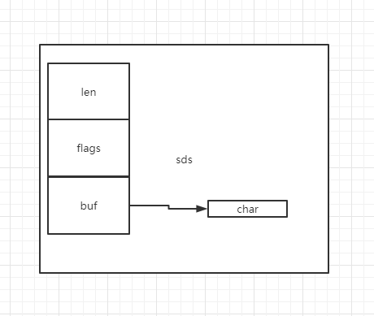

## SDS

redis中没有直接使用C语言的字符串，而是自定义了一种名为简单动态字符串的抽象类型——SDS。我们下载redis源码，可以在src目录下找到一个`sds.h`的文件，打开这个文件查看它的部分代码：

```

typedef char *sds;

/* Note: sdshdr5 is never used, we just access the flags byte directly.
 * However is here to document the layout of type 5 SDS strings. */
struct __attribute__ ((__packed__)) sdshdr5 {
    unsigned char flags; /* 3 lsb of type, and 5 msb of string length */
    char buf[];
};
struct __attribute__ ((__packed__)) sdshdr8 {
    uint8_t len; /* used */
    uint8_t alloc; /* excluding the header and null terminator */
    unsigned char flags; /* 3 lsb of type, 5 unused bits */
    char buf[];
};
struct __attribute__ ((__packed__)) sdshdr16 {
    uint16_t len; /* used */
    uint16_t alloc; /* excluding the header and null terminator */
    unsigned char flags; /* 3 lsb of type, 5 unused bits */
    char buf[];
};
struct __attribute__ ((__packed__)) sdshdr32 {
    uint32_t len; /* used */
    uint32_t alloc; /* excluding the header and null terminator */
    unsigned char flags; /* 3 lsb of type, 5 unused bits */
    char buf[];
};
```

根据代码注释我们知道：

- len 表示字符串长度
- alloc 表示实际分配的空间
- flags 低三位表示类型，高五位未使用
- buf 存储的字符

因此sds示意图就是这样的：


那么redis为什么要这么设计呢，出于以下几点考虑：

- 降低获取字符串长度的复杂度，通过获取sds的len属性就能直接获取字符串长度。
- 避免缓冲区溢出，当拼接字符串的时候可以通过alloc属性判断是否会超出长度
- 减少修改字符串所带来的内存重新分配次数。因为sds会预留内存空间（alloc>len）,如果修改后的字符串长度小于alloc，则不需要重新分配内存


## 链表

在redis 源码中链表的定义可以通过`adlist.h`查看：

```
/* Node, List, and Iterator are the only data structures used currently. */

typedef struct listNode {
    struct listNode *prev;
    struct listNode *next;
    void *value;
} listNode;

typedef struct listIter {
    listNode *next;
    int direction;
} listIter;

typedef struct list {
    listNode *head;
    listNode *tail;
    void *(*dup)(void *ptr);
    void (*free)(void *ptr);
    int (*match)(void *ptr, void *key);
    unsigned long len;
} list;
```

从源码我们可以看出链表由三个结构体来维护，`list` \ `listNode` \ `listIter` 。list结构为链表提供了表头指针 head，表尾指针 tail，链表长度 len。redis 链表有以下特点：
- 双端：listNode 带有prev和next属性，它们分别指向前置节点和后置节点，从而构成双端队列；
- 有表头表尾指针：表头指针head，表尾指针tail，降低程序获得表头指针表尾指针的复杂度；
- 有链表长度：list中属性len记录了链表长度，使其降低了获得链表长度的复杂度。

## 字典
字典即map，redis字典

## 跳跃表

## 整数集合

## 压缩表

## 对象
