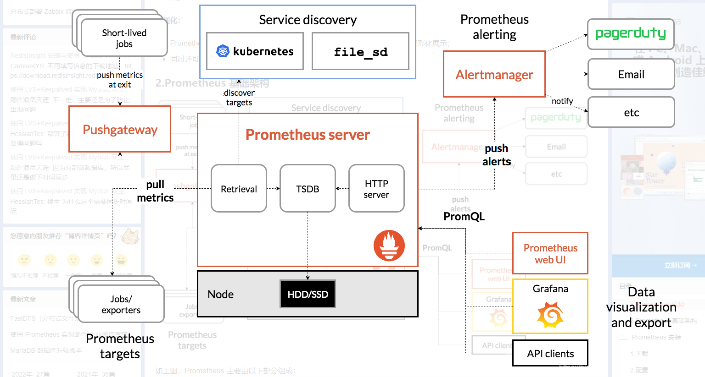

## 普罗米修斯介绍


Prometheus（普罗米修斯）是一套开源的监控系统，其基本原理是通过 HTTP 协议周期性抓取被监控组件的状态，不需要任何 SDK 或者其他的集成过程，其架构如图：



Prometheus 主要由以下部分组成：

- prometheus server: 是 Prometheus 组件中的核心部分，负责实现对监控数据的获取，存储以及查询;
- exporter: 采集端，通过 http 服务的形式保留一个 url 地址，prometheus server 通过访问该 exporter 提供的 endpoint 端点，即可获取到需要采集的监控数据。
- AlertManager: 在 prometheus 中，支持基于 PromQL 创建告警规则，如果满足定义的规则，则会产生一条告警信息，进入 AlertManager 进行处理。可以集成邮件，微信或者通过 webhook 自定义报警。
- Pushgateway: 由于 Prometheus 数据采集采用 pull 方式进行设置的， 内置必须保证 prometheus server 和对应的 exporter 必须通信，当网络情况无法直接满足时，可以使用 pushgateway 来进行中转，可以通过 pushgateway 将内部网络数据主动 push 到 gateway 里面去，而 prometheus 采用 pull方式拉取 pushgateway 中数据

普罗米修斯的数据存储采用的是时间序列数据(TimeSeries Data)，它是按照时间顺序记录系统、设备状态变化的数据。

默认情况下 Prometheus 会将采集的数据存储到本机的 `/usr/local/prometheus/data` 目录，存储数据的大小受限和扩展不便；如果只作为测试自然不需要担心这个问题，如果用于生产的话需要安装配置时序数据库`influxdb`。


## 普罗米修斯使用初体验

在 kubesphere 的安装中，普罗米修斯是配套安装的，前文介绍过kubesphere的安装教程。这里我直接使用现成的Prometheus系统。有安装需求的小伙伴建议使用k8s+helm进行安装。

KubeSphere 通过 NodePort 访问内置的 Prometheus 服务，服务类型更改为 NodePort，同时修改外部访问端口：
```
kubectl edit svc -n kubesphere-monitoring-system prometheus-k8s
```

